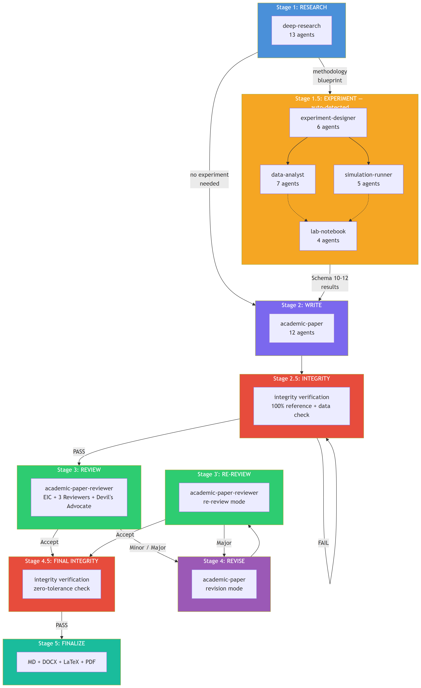
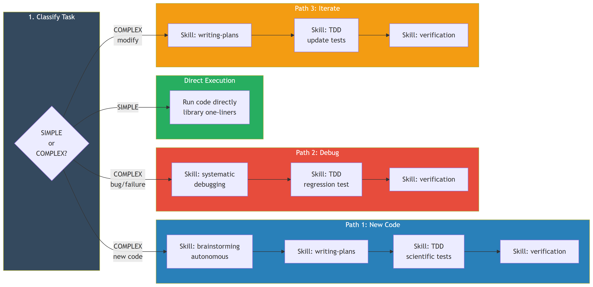

# Academic Research Skills for Claude Code

[](https://creativecommons.org/licenses/by-nc/4.0/)

A Claude Code plugin covering the full academic research lifecycle — from literature review through experimentation, statistical analysis, paper writing, peer review, and publication. 8 skills, 57 agents, 13 handoff schemas, and full pipeline orchestration. Experiment skills integrate with the [superpowers](https://github.com/obra/superpowers) plugin for disciplined, test-driven code development.

## Skills

| Skill | Agents | What it does | Key Modes |
|-------|--------|-------------|-----------|
| **deep-research** v2.4 | 13 | Research team with systematic review, PRISMA, meta-analysis | full, quick, socratic, review, lit-review, fact-check, systematic-review |
| **experiment-designer** v1.0 | 6 | Experiment protocol, power analysis, instruments, randomization | full, guided, quick, power-only, instrument |
| **data-analyst** v1.0 | 7 | Statistical analysis execution with APA-formatted results | full, guided, quick, assumption-check, exploratory, replication |
| **simulation-runner** v1.0 | 5 | Monte Carlo, bootstrap, agent-based models, parameter sweeps | full, guided, quick, power-sim, sensitivity, bootstrap |
| **lab-notebook** v1.0 | 4 | Experiment research record with provenance tracking | full, log-entry, deviation, snapshot, export, audit |
| **academic-paper** v2.5 | 12 | Paper writing with experiment integration and LaTeX output | full, plan, outline-only, revision, abstract-only, lit-review, format-convert, citation-check |
| **academic-paper-reviewer** v1.4 | 7 | Multi-perspective peer review (EIC + 3 reviewers + Devil's Advocate) | full, re-review, quick, methodology-focus, guided |
| **academic-pipeline** v2.7 | 3 | Full pipeline orchestrator coordinating all skills above | auto-detected stages |

## Pipeline

<p align="center">
  
</p>

The experiment stages (1.5) are auto-detected from the methodology blueprint produced by deep-research. Literature reviews, theoretical papers, and policy analyses skip straight to writing.

## Superpowers Integration

Experiment skills (`experiment-designer`, `data-analyst`, `simulation-runner`) integrate with the [superpowers](https://github.com/obra/superpowers) plugin for disciplined code development. When agents write complex code — custom simulations, SEM models, multi-step analysis pipelines — they autonomously invoke superpowers skills via the `Skill` tool:

<p align="center">
  
</p>

**How it works:**

- A **category-based lookup table** classifies each code task as SIMPLE or COMPLEX
- **SIMPLE** tasks (standard t-test, basic power analysis, seaborn plots) execute directly — zero overhead
- **COMPLEX** tasks (custom DGPs, SEM, agent-based models, multi-step pipelines) trigger the superpowers workflow:
  - Each step invokes the real superpowers skill via `Skill("superpowers:...")`, loading the full skill content
  - Brainstorming runs autonomously — the agent uses upstream research context instead of asking the user
  - TDD is adapted for scientific code — known-answer tests, synthetic data validation, reproducibility checks
- **Fully autonomous** — no human checkpoints; escape hatch surfaces to user after 2 failed attempts
- **Always active** — works both standalone and within the pipeline

**Prerequisite:** `claude plugin install superpowers@claude-plugins-official`

### Complexity Classification

| Category | Examples |
|----------|----------|
| **SIMPLE** | t-test, ANOVA, correlation, chi-square, standard power analysis, seaborn plots, bootstrap CI |
| **COMPLEX** | Custom DGPs, Monte Carlo simulations, SEM/HLM, agent-based models, parameter sweeps, mediation bootstrap, multi-panel figures, survival analysis |

### Scientific TDD

| Agent | Test Approach |
|-------|--------------|
| power_analyst | Known-answer tests against published power tables, boundary tests, monotonicity checks |
| analysis_executor | Synthetic data with known parameters, null hypothesis tests, output structure validation |
| data_preparation | Missing count assertions, no-new-NaN checks, type validation, row count guards |
| visualization | File existence, smoke tests, APA dimension checks |
| model_builder | Purity tests (same seed = same output), structure tests, edge case tests, distribution tests |
| execution_engine | Reproducibility tests, convergence tests, parallel equivalence tests |

## Installation

### As a Claude Code Plugin (Recommended)

```bash
# Register as a local marketplace
claude plugin marketplace add /path/to/academic-research-skills

# Install the plugin
claude plugin install academic-research-skills
```

After installation, all 8 skills auto-trigger in every project based on your request.

### As a Standalone Project

```bash
git clone https://github.com/pouriamrt/academic-research-skills.git
cd academic-research-skills
claude
```

### As Project Skills

```bash
cd /path/to/your/project
mkdir -p .claude/skills
git clone https://github.com/pouriamrt/academic-research-skills.git .claude/skills/academic-research-skills
```

## Usage

```bash
# Full pipeline (research -> experiment -> write -> review -> publish)
"I want to write a research paper on the effect of gamification on student engagement"

# Just research
"Research the impact of AI on healthcare outcomes"

# Design an experiment
"Design an experiment testing whether AI tutoring improves calculus scores"

# Analyze data
"Analyze my data: ./experiment_data.csv"

# Run a simulation
"Run a Monte Carlo power simulation for a 2x3 mixed ANOVA"

# Write a paper (with guided planning)
"Guide me through writing a paper on demographic decline in higher education"

# Review a paper
"Review this paper" (then provide the paper)
```

## Recommended Settings

| Setting | Purpose |
|---------|---------|
| **Claude Opus 4.6 + Max plan** | Full pipeline can exceed 200K+ tokens |
| **`--dangerously-skip-permissions`** | Uninterrupted autonomous execution for long pipelines |
| **superpowers plugin** | Enables disciplined TDD workflow for complex experiment code |

## Supported Formats

**Citation:** APA 7.0 (default), Chicago, MLA, IEEE, Vancouver
**Paper structures:** IMRaD, Literature Review, Theoretical, Case Study, Policy Brief, Conference Paper
**Output:** Markdown, LaTeX, DOCX, PDF (via tectonic)
**Statistics:** t-tests, ANOVA, regression, chi-square, SEM, HLM, survival analysis, Bayesian, and more
**Visualization:** matplotlib/seaborn statistical plots (300 DPI, APA-formatted, colorblind-safe) + Mermaid MCP structural diagrams (CONSORT flow, analysis workflow, DGP architecture, convergence status)

## License

[CC-BY-NC 4.0](https://creativecommons.org/licenses/by-nc/4.0/) — Free to share and adapt with attribution for non-commercial use.
