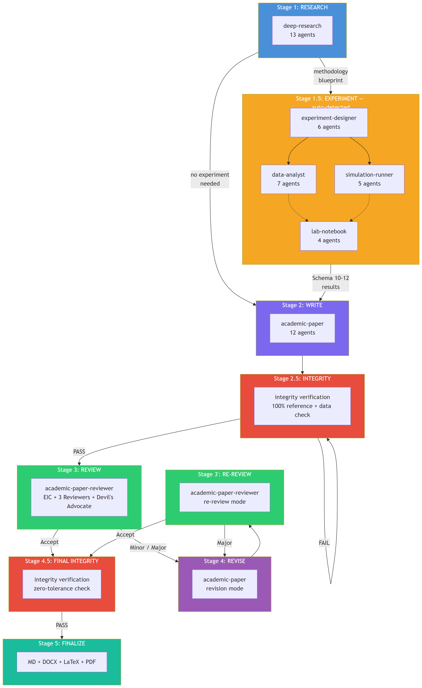
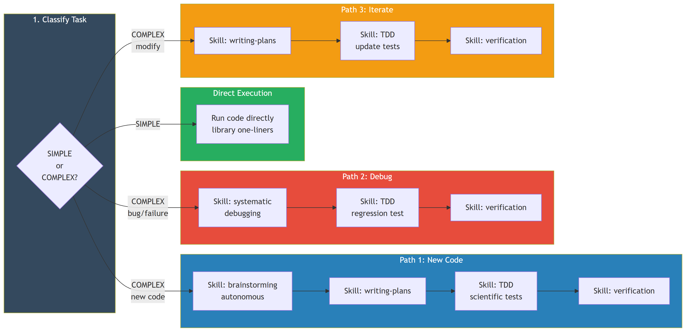

# Academic Research Skills for Claude Code

[](https://github.com/pouriamrt/academic-research-skills)
[](https://creativecommons.org/licenses/by-nc/4.0/)

A Claude Code plugin covering the full academic research lifecycle — from literature review through experimentation, statistical analysis, paper writing, peer review, and publication. **8 skills, 58+ agents, 20 handoff schemas + 6 claim-audit schemas**, full pipeline orchestration with PRISMA-trAIce + RAISE compliance gates, reviewer + writer/evaluator sprint contracts, opt-in L3 claim ↔ reference faithfulness audit gate (v3.18.0 #103), passport reset boundary for long-running sessions, three-layer citation locator, temporal verification (v3.18.0 #135), Phase Boundary protocol (v3.18.0 #133), cross-index triangulation (v3.18.0 #102), and collaboration depth observer. **v3.17.0 runs the pipeline unattended by default — set `ARS_INTERACTIVE=1` to restore prompts.** English-only output. New `/ars-mark-read`, `/ars-unmark-read`, `/ars-reviewer` plugin commands. Experiment skills integrate with the [superpowers](https://github.com/obra/superpowers) plugin for disciplined, test-driven code development.

## Skills

**Install in 30 seconds** (Claude Code CLI / VS Code / JetBrains, v3.17.0+; plugin packaging from upstream v3.7.0):

```text
/plugin marketplace add Imbad0202/academic-research-skills
/plugin install academic-research-skills
```

Then try `/ars-plan` to walk through your paper structure via Socratic dialogue, or jump to [Quick install](#quick-install) for prerequisites and the traditional symlink flow.

> **AI is your copilot, not the pilot.** This tool won't write your paper for you. It handles the grunt work — hunting down references, formatting citations, verifying data, checking logical consistency — so you can focus on the parts that actually require your brain: defining the question, choosing the method, interpreting what the data means, and writing the sentence after "I argue that."
>
> Unlike a humanizer, this tool doesn't help you hide the fact that you used AI. It helps you write better. Style Calibration learns your voice from past work. Writing Quality Check catches the patterns that make prose feel machine-generated. The goal is quality, not cheating.

### Why human-in-the-loop, not full automation?

Lu et al. (2026, *Nature* 651:914-919) built **The AI Scientist** — the first fully autonomous AI research system to publish a paper through blind peer review at a top-tier ML venue (ICLR 2025 workshop, score 6.33/10 vs workshop average 4.87). Their Limitations section enumerates the failure modes that any fully-autonomous AI research pipeline inherits: implementation bugs, hallucinated results, shortcut reliance, bug-as-insight reframing, methodology fabrication, frame-lock, citation hallucinations.

ARS is built on the premise that **a human researcher augmented by AI avoids these failure modes better than either alone**. Stage 2.5 and Stage 4.5 integrity gates run a 7-mode blocking checklist (see [`academic-pipeline/references/ai_research_failure_modes.md`](academic-pipeline/references/ai_research_failure_modes.md)); the reviewer offers an opt-in calibration mode that measures its own FNR/FPR against a user-supplied gold set.

[**Zhao et al.**](https://arxiv.org/abs/2605.07723) (2026-05) audited 111M references across 2.5M papers on arXiv, bioRxiv, SSRN, and PMC. Their conservative estimate is 146,932 hallucinated citations for 2025 alone, with an observed mid-2024 inflection; for the bioRxiv-to-PMC pairing they report 85.3% preprint-to-published persistence. The paper describes "real citations deployed to support claims the cited references do not actually make" as an open challenge. ARS v3.7.1 added trust-chain frontmatter for source provenance; v3.7.3 added locator infrastructure (three-layer citation anchors) for future claim-level audits and surfaces advisory risk signals at cite time (ARS labels the claim-faithfulness gap internally as "L3"; this is ARS terminology, not the paper's). v3.7.x is motivated by Zhao et al.'s corpus-scale findings; corpus-scale evaluation of ARS itself remains future work.

v3.3 was inspired by [**PaperOrchestra**](https://arxiv.org/abs/2604.05018) (Song, Song, Pfister & Yoon, 2026, Google): Semantic Scholar API verification, anti-leakage protocol, VLM figure verification, and score trajectory tracking.

---

| Skill | Agents | What it does | Key Modes |
|-------|--------|-------------|-----------|
| **deep-research** v2.9.4 | 14 | Research team with concept lineage, systematic review, PRISMA, meta-analysis, Semantic Scholar API verification | full, quick, socratic*, review, lit-review, fact-check, systematic-review |
| **experiment-designer** v1.0.1 | 6 | Experiment protocol, power analysis, instruments, randomization | full, guided*, quick, power-only, instrument |
| **data-analyst** v1.0.1 | 7 | Statistical analysis execution with APA-formatted results | full, guided*, quick, assumption-check, exploratory, replication |
| **simulation-runner** v1.0.1 | 5 | Monte Carlo, bootstrap, agent-based models, parameter sweeps | full, guided*, quick, power-sim, sensitivity, bootstrap |
| **lab-notebook** v1.0.1 | 4 | Experiment research record with provenance tracking | full, log-entry, deviation, snapshot, export, audit |
| **academic-paper** v3.2.0 | 11 | English-only paper writing with experiment integration, LaTeX output, anti-leakage protocol, VLM figure verification, disclosure mode | full, plan*, outline-only, revision, revision-coach, abstract-only, lit-review, format-convert, citation-check, disclosure |
| **academic-paper-reviewer** v1.9.1 | 7 | Multi-perspective peer review (EIC + 3 reviewers + Devil's Advocate + optional cross-model DA critique) with calibration + sprint-contract gates; auto-routes from machine-readable verdict | full, re-review, quick, methodology-focus, guided*, calibration |
| **academic-pipeline** v3.17.0 | 4 in-skill + 1 shared (`compliance_agent`) | Auto-by-default pipeline orchestrator with AI Research Failure Mode Checklist (Lu 2026), score trajectory tracking, early-stopping, PRISMA-trAIce + RAISE compliance (Schema 19), sprint-contract gates (Schema 20 / 20.1), passport reset boundary, collaboration depth observer | auto-detected stages |

`*` = mode only fires when `ARS_INTERACTIVE=1` is set. In auto mode (default) the orchestrator forces `mode=full` on every dispatched sub-skill.

See the [Quick Reference Card](docs/QUICK_REFERENCE.md) for a full "I want to X → use skill Y in mode Z" lookup table, [MODE_REGISTRY.md](MODE_REGISTRY.md) for the single source of truth on all 24+ modes (with spectrum / output / oversight / triggers), and [POSITIONING.md](POSITIONING.md) for the design philosophy and allowed/discouraged uses.

## Architecture & pipeline

**👉 [docs/ARCHITECTURE.md](docs/ARCHITECTURE.md)** — the full pipeline view: flow diagram, stage-by-stage matrix, data-access flow, skill dependency graph, quality gates, and mode list. (Fork extends with experiment Stage 1.5.)

## Quick install

**Prerequisites**

- [Claude Code](https://docs.claude.com/en/docs/claude-code/setup) (latest; plugin packaging requires recent versions)
- `ANTHROPIC_API_KEY` exported, or set on first `claude` run
- *Optional:* Pandoc for DOCX (via Pandoc when available); Markdown + instructions otherwise. Tectonic + Source Han Serif TC for APA 7.0 PDF. Markdown output works without either.

**Plugin install (v3.17.0+, recommended):**

```text
/plugin marketplace add pouriamrt/academic-research-skills
/plugin install academic-research-skills
```

(Upstream channel: `Imbad0202/academic-research-skills` — fork omits the experiment pipeline.)

**Verify it works:** run `/ars-plan` and describe a paper you're working on — ARS will start a Socratic dialogue to map out chapter structure. For a single-shot test instead, try `/ars-lit-review "your topic"`.

**👉 [docs/SETUP.md](docs/SETUP.md)** — full guide: install Claude Code, set up API keys, optional Pandoc/tectonic for DOCX/PDF, cross-model verification (`ARS_CROSS_MODEL`), and six installation methods (Plugin, project skills, global skills, claude.ai Project, repo-cloned, Claude Science import).

**Using Claude Science?** The eight skills import directly: **Skills → Import from GitHub**, paste `https://github.com/pouriamrt/academic-research-skills`, **Preview**, then **Import 8 skills** (requires v3.20.0+ of this fork — the importer reads the explicit skill paths in the marketplace manifest). Imports are point-in-time snapshots: re-import after ARS updates. Imported skills carry the ARS methodology (research / writing / review protocols); Claude Code-specific machinery — slash commands, hooks, subagent orchestration — does not transfer. See [docs/SETUP.md](docs/SETUP.md) Method 5 for details.

**Using Codex CLI?** Upstream maintains a sibling distribution at [`Imbad0202/academic-research-skills-codex`](https://github.com/Imbad0202/academic-research-skills-codex) — same workflow content, Codex-native packaging. Fork has not yet been ported to Codex.

**Third-party platforms and integrations** that wrap or host ARS are listed in [THIRD_PARTY.md](THIRD_PARTY.md) — community-submitted and not reviewed or endorsed by the maintainer.

## Performance & cost

**👉 [docs/PERFORMANCE.md](docs/PERFORMANCE.md)** — per-mode token budgets, full-pipeline estimate (~$4–6 for a 15k-word paper), and recommended Claude Code settings (Auto mode; Agent Team optional).

## Guides & articles

- [Academic Writing Shouldn't Be a Solo Act](https://open.substack.com/pub/edwardwu223235/p/academic-writing-shouldnt-be-a-solo?r=4dczl&utm_medium=ios) — upstream's full pipeline walkthrough

## Pipeline

<p align="center">
  
</p>

The experiment stages (1.5) are auto-detected from the methodology blueprint produced by deep-research. Literature reviews, theoretical papers, and policy analyses skip straight to writing.

- **Deep Research** — 14-agent research team with concept lineage, Socratic guided mode + systematic review / PRISMA + SCR Loop + **intent detection** + **dialogue health monitoring** + **optional cross-model DA** + **argumentation & reasoning cognitive framework** + **Semantic Scholar API verification** (v3.3 PaperOrchestra)
- **Experiment Designer / Data Analyst / Simulation Runner / Lab Notebook** — 4 experiment skills (22 agents) with auto-detected pipeline integration, power analysis, APA-formatted statistics, Monte Carlo / bootstrap / SEM / HLM, full provenance tracking, and superpowers integration for disciplined code development
- **Academic Paper** — 11-agent English-only paper writing with experiment results integration (Schema 11/12), Style Calibration, Writing Quality Check, LaTeX output hardening, visualization, revision coaching, citation conversion, **writing judgment framework**, **anti-leakage protocol**, **VLM figure verification**, **disclosure mode** (venue-specific AI usage statements), and **v3.6.6/v3.6.8 generator-evaluator sprint contract** for paper drafting (Schema 20.1, renumbered from upstream 13.1)
- **Academic Paper Reviewer** — Multi-perspective peer review with 0-100 quality rubrics (EIC + 3 dynamic reviewers + Devil's Advocate with **concession threshold protocol** + **attack intensity preservation** + **optional cross-model review**) + **R&R traceability matrix** + **read-only constraint** + **review quality thinking framework** + **calibration mode** (FNR/FPR measurement against gold-standard sets) + **v3.6.2 sprint-contract hard gate** for reviewers (Schema 20, renumbered from upstream 13)
- **Academic Pipeline** — Full pipeline orchestrator (10 stages + experiment re-entry) with adaptive checkpoints, audible alerts, claim verification, Material Passport, **optional cross-model integrity verification**, **mid-conversation reinforcement**, **self-check questions**, **score trajectory tracking**, **early-stopping criterion**, **AI Research Failure Mode Checklist** (Lu 2026 — 7-mode taxonomy, mandatory blocking at Stage 2.5/4.5), **PRISMA-trAIce + RAISE compliance** (Schema 19, v3.4.0+), and **passport reset boundary** for long-running sessions (v3.6.3+)

## Upstream features adopted in v3.16

- **Data Access Level Metadata** (v3.3.2+) — every skill declares `data_access_level` (`raw` / `redacted` / `verified_only`); enforced by `scripts/check_data_access_level.py`. Pattern adapted from Anthropic's automated-w2s-researcher (2026). See [`shared/ground_truth_isolation_pattern.md`](shared/ground_truth_isolation_pattern.md).
- **Task Type Annotation** (v3.3.2+) — every skill declares `task_type` (`open-ended` or `outcome-gradable`).
- **Benchmark Report Schema** (v3.3.5+) — JSON Schema + lint for honest benchmark comparisons.
- **Artifact Reproducibility Lockfile** (v3.3.5+) — optional `repro_lock` sub-block on Material Passport. **Configuration documentation, not replay guarantee.**
- **Literature corpus adapter contract** (v3.6.4+) + **consumer integration** (v3.6.5+) — bring-your-own bibliography via Zotero / Obsidian / folder scan adapters.
- **Trust-chain frontmatter** (v3.7.1+) + **claim faithfulness locator** (v3.7.3+) — three-layer citation anchors with NO-LOCATOR hard gate.
- **Model Tiering** (#517, v3.16+) — optional `ARS_MODEL_TIERING` switch with two directions: `economy` (execution-type agents dispatch one tier below the session model, floor Opus-class) and `quality-boost` (judgment-type agents at integrity gates and final review step up to the frontier tier). Default unset = byte-equivalent to pre-#517 behavior. See [`shared/model_tiering.md`](shared/model_tiering.md).
- **Canonical Cross-Model Handoff Envelope** (#527, v3.17+) — the owner→dispatcher→owner blind-checkpoint transport path (#523) now has a machine-stable `[CROSS-MODEL-HANDOFF v1]` envelope with a normative Python grammar (`scripts/cross_model_handoff.py`) instead of prose-only enforcement, pinning agreement/divergence/malformed-result routing across all three checkpoint owners. See [`shared/cross_model_verification.md`](shared/cross_model_verification.md) §"Cross-model handoff envelope".
- **Experiment Provenance Intake** (#260) — optional `experiment_provenance[]` on the Material Passport records experiments run **outside the ARS experiment skills** (the fork's experiment-designer / data-analyst / simulation-runner produce Schema 11/12 records natively; `experiment_provenance[]` covers externally run experiments), and manuscript claims join to them via `claim_intent_manifest.planned_experiment_ids[]`. The integrity gate (Stage 2.5/4.5) audits each experiment-backed claim against declared provenance — `ALIGNED` / `OVERSTATED` / `NOT_SUPPORTED_BY_PROVENANCE` / `PROVENANCE_INSUFFICIENT` — **without judging whether the experiment itself was correct**. A fail-closed `experiment_intake_declaration` makes "did you run experiments?" an explicit Stage 1 decision (even literature-only runs declare `no_experiments_declared`). See [`shared/handoff_schemas.md`](shared/handoff_schemas.md) §"Experiment Provenance Intake (#260)".

## Superpowers Integration

Experiment skills (`experiment-designer`, `data-analyst`, `simulation-runner`) integrate with the [superpowers](https://github.com/obra/superpowers) plugin for disciplined code development. When agents write complex code — custom simulations, SEM models, multi-step analysis pipelines — they autonomously invoke superpowers skills via the `Skill` tool:

<p align="center">
  
</p>

**How it works:**

- A **category-based lookup table** classifies each code task as SIMPLE or COMPLEX
- **SIMPLE** tasks (standard t-test, basic power analysis, seaborn plots) execute directly — zero overhead
- **COMPLEX** tasks (custom DGPs, SEM, agent-based models, multi-step pipelines) trigger the superpowers workflow:
  - Each step invokes the real superpowers skill via `Skill("superpowers:...")`, loading the full skill content
  - Brainstorming runs autonomously — the agent uses upstream research context instead of asking the user
  - TDD is adapted for scientific code — known-answer tests, synthetic data validation, reproducibility checks
- **Fully autonomous** — no human checkpoints; escape hatch surfaces to user after 2 failed attempts
- **Always active** — works both standalone and within the pipeline

**Prerequisite:** `claude plugin install superpowers@claude-plugins-official`

### Complexity Classification

| Category | Examples |
|----------|----------|
| **SIMPLE** | t-test, ANOVA, correlation, chi-square, standard power analysis, seaborn plots, bootstrap CI |
| **COMPLEX** | Custom DGPs, Monte Carlo simulations, SEM/HLM, agent-based models, parameter sweeps, mediation bootstrap, multi-panel figures, survival analysis |

### Scientific TDD

| Agent | Test Approach |
|-------|--------------|
| power_analyst | Known-answer tests against published power tables, boundary tests, monotonicity checks |
| analysis_executor | Synthetic data with known parameters, null hypothesis tests, output structure validation |
| data_preparation | Missing count assertions, no-new-NaN checks, type validation, row count guards |
| visualization | File existence, smoke tests, APA dimension checks |
| model_builder | Purity tests (same seed = same output), structure tests, edge case tests, distribution tests |
| execution_engine | Reproducibility tests, convergence tests, parallel equivalence tests |

---

## Showcase: real pipeline output

See the complete artifacts from a real 10-stage pipeline run — peer review reports, integrity verification reports, and the final paper:

**[Browse all pipeline artifacts →](examples/showcase/)**

| Artifact | Description |
|---|---|
| [Final Paper](examples/showcase/full_paper_apa7.pdf) | APA 7.0 formatted, LaTeX-compiled |
| [Integrity Report — Pre-Review](examples/showcase/integrity_report_stage2.5.pdf) | Stage 2.5: caught 15 fabricated refs + 3 statistical errors |
| [Integrity Report — Final](examples/showcase/integrity_report_stage4.5.pdf) | Stage 4.5: zero regressions confirmed |
| [Peer Review Round 1](examples/showcase/stage3_review_report.pdf) | EIC + 3 Reviewers + Devil's Advocate |
| [Re-Review](examples/showcase/stage3prime_rereview_report.pdf) | Verification after revisions |
| [Peer Review Round 2](examples/showcase/stage3_review_report_r2.pdf) | Follow-up review |
| [Response to Reviewers](examples/showcase/response_to_reviewers_r2.pdf) | Point-by-point author response |
| [Post-Publication Audit Report](examples/showcase/post_publication_audit_2026-03-09.pdf) | Independent full-reference audit: found 21/68 issues missed by 3 rounds of integrity checks |

---

## Built-in Experiment Pipeline

This fork ships with **4 experiment skills** (22 agents) that auto-detect from the methodology blueprint and run inline within the pipeline. No external companion repo required. (Upstream Imbad0202 maintains the [Experiment Agent](https://github.com/Imbad0202/experiment-agent) as a separate skill — fork has it built in.)

```
Stage 1 RESEARCH  →  RQ Brief + Methodology Blueprint
        ↓
Stage 1.5 EXPERIMENT (auto-detected)
  ├─ experiment-designer → protocol, power analysis, instruments
  ├─ data-analyst        → real-data statistics with APA reporting
  ├─ simulation-runner   → Monte Carlo / bootstrap / SEM / HLM / ABM
  └─ lab-notebook        → provenance tracking + deviation log
        ↓
Stage 2 WRITE  →  paper with verified experiment results integrated
```

**Schema flow**: experiment-designer (Schema 10/13) → data-analyst / simulation-runner (Schema 11) → lab-notebook (Schema 12) → academic-paper (integrated into Methods + Results sections).

**Reviewer-driven re-entry**: if reviewers request new experimental data, the editorial synthesizer flags items with `requires_new_experiment = true` and the pipeline re-enters Stage 1.5-R / 1.5-R2 before text revision. Users can opt out and convert items to Acknowledged Limitations.

**Code discipline**: complex experiment code (custom DGPs, SEM, agent-based models, multi-step analysis pipelines) auto-invokes the [superpowers](https://github.com/obra/superpowers) plugin's TDD workflow with scientific test patterns (known-answer tests, synthetic data validation, reproducibility checks).

> **Upstream alternative**: the upstream suite (Imbad0202) splits experiment work into a separate [experiment-agent](https://github.com/Imbad0202/experiment-agent) companion repo. This fork takes the opposite design: experiments are built in. If you prefer the lean writer-focused upstream + standalone experiment-agent, use the upstream repo instead.

**Stage 1 intake declaration (#260)**: at Stage 1, ARS detects whether the run will carry experiment-backed claims and sets a fail-closed `experiment_intake_declaration` on the Material Passport. If you ran experiments externally, the scholar enters one `experiment_provenance[]` entry per experiment (`experiment_id`, nested `repro_lock`, `planned_vs_executed[]`, `negative_results[]`, `known_limitations[]`) and the declaration is set to `experiments_declared`; if not, it is set to `no_experiments_declared`. The declaration is **required on every post-#260 passport** — a run that touches no experiments still declares `no_experiments_declared`, so the integrity gate can never be silently bypassed by a forgotten provenance block. The `experiment_id`s are frozen at this intake point; the writers later reference them via `planned_experiment_ids[]`.

**Teaching-side companion**: [Teaching Skills](https://github.com/YujxZJCN/teaching-skills) applies the ARS architecture (skill ensembles, shared contracts, staged gates, a Course Passport) to the teaching side of academic life — course design → lessons → assessment → delivery → reflection; its `sotl` mode hands classroom-inquiry projects off to ARS deep-research / academic-paper for the publication phase.

---

## Installation

### As a Claude Code Plugin (Recommended)

```bash
# Register as a local marketplace
claude plugin marketplace add /path/to/academic-research-skills

# Install the plugin
claude plugin install academic-research-skills
```

After installation, all 8 skills auto-trigger in every project based on your request.

### As a Standalone Project

```bash
git clone https://github.com/pouriamrt/academic-research-skills.git
cd academic-research-skills
claude
```

### As Project Skills

```bash
cd /path/to/your/project
mkdir -p .claude/skills
git clone https://github.com/pouriamrt/academic-research-skills.git .claude/skills/academic-research-skills
```

## Usage

```bash
# Full pipeline (research -> experiment -> write -> review -> publish)
"I want to write a research paper on the effect of gamification on student engagement"

# Just research
"Research the impact of AI on healthcare outcomes"

# Design an experiment
"Design an experiment testing whether AI tutoring improves calculus scores"

# Analyze data
"Analyze my data: ./experiment_data.csv"

# Run a simulation
"Run a Monte Carlo power simulation for a 2x3 mixed ANOVA"

# Write a paper (with guided planning)
"Guide me through writing a paper on demographic decline in higher education"

# Review a paper
"Review this paper" (then provide the paper)
```

## Validation Tools

The `tools/` directory contains automated validation scripts (Python stdlib only, no external dependencies):

| Tool | Purpose | Command |
|------|---------|---------|
| **self_test.py** | Structural integrity check (196+ checks across 7 categories) | `python tools/self_test.py` |
| **validate_schemas.py** | Handoff schema cross-reference validation | `python tools/validate_schemas.py` |
| **check_schema_versions.py** | Schema versioning and migration registry check | `python tools/check_schema_versions.py` |
| **generate_dependency_graph.py** | Auto-generate Mermaid agent dependency graph | `python tools/generate_dependency_graph.py --output file` |
| **generate_dashboard.py** | Pipeline progress dashboard (HTML) from state JSON | `python tools/generate_dashboard.py --init` |
| **replay_experiments.py** | Re-execute reproducibility scripts and compare outputs | `python tools/replay_experiments.py --dry-run` |

Run `python tools/self_test.py` after making changes to catch regressions. CI workflows under `.github/workflows/` (added by upstream v3.6.x): `pytest.yml`, `spec-consistency.yml`, `freshness-check.yml`.

## Mode reference (per skill)

#### Deep Research (8 modes)

```
"Research the impact of AI on higher education"       → full mode
"Give me a quick brief on X"                          → quick mode
"Do a systematic review on X with PRISMA"             → systematic-review mode
"Guide my research on X"                              → socratic mode (guided)
"Fact-check these claims"                             → fact-check mode
"Do a literature review on X"                         → lit-review mode
"Compare these papers in WHY/HOW/WHAT format"         → three-way-scan mode
"Review this paper's research quality"                → review mode
```

#### Academic Paper (11 modes)

```
"Write a paper on X"                                  → full mode
"Guide me through writing a paper"                    → plan mode (guided)
"Build a paper outline"                               → outline-only mode
"I have a draft, here are reviewer comments"          → revision mode
"Parse these reviewer comments into a roadmap"        → revision-coach mode
"Write an abstract for this paper"                    → abstract-only mode
"Turn this into a literature review paper"            → lit-review mode
"Convert to LaTeX" / "Convert citations to IEEE"      → format-convert mode
"Check citations"                                     → citation-check mode
"Generate an AI disclosure statement for NeurIPS"     → disclosure mode
"Audit my rebuttal draft against the reviews"         → rebuttal-audit mode
```

#### Academic Paper Reviewer (6 modes)

```
"Review this paper"                                   → full mode (EIC + R1/R2/R3 + Devil's Advocate)
"Quick assessment of this paper"                      → quick mode
"Guide me to improve this paper"                      → guided mode
"Check the methodology"                               → methodology-focus mode
"Verify the revisions"                                → re-review mode
"Calibrate this reviewer against my gold set"         → calibration mode
```

#### Academic Pipeline (Orchestrator)

```
"I want to write a complete research paper"           → full pipeline from Stage 1
"I already have a paper, review it"                   → mid-entry at Stage 2.5 (integrity first)
"I received reviewer comments"                        → mid-entry at Stage 4
```

> Pipeline ends with **Stage 6: Process Summary** — auto-generates a paper creation process record with 6-dimension Collaboration Quality Evaluation (1–100 scoring).

## Recommended Settings

| Setting | Purpose |
|---------|---------|
| **Claude Opus 4.6 + Max plan** | Full pipeline can exceed 200K+ tokens |
| **`--dangerously-skip-permissions`** | Uninterrupted autonomous execution for long pipelines |
| **superpowers plugin** | Enables disciplined TDD workflow for complex experiment code |

## Supported Formats

**Citation:** APA 7.0 (default), Chicago, MLA, IEEE, Vancouver
**Paper structures:** IMRaD, Literature Review, Theoretical, Case Study, Policy Brief, Conference Paper
**Output:** Markdown, LaTeX, DOCX, PDF (via tectonic)
**Statistics:** t-tests, ANOVA, regression, chi-square, SEM, HLM, survival analysis, Bayesian, mediation, MANOVA, and more
**Visualization:** matplotlib/seaborn statistical plots (300 DPI, APA-formatted, colorblind-safe) + Mermaid MCP structural diagrams (CONSORT flow, analysis workflow, DGP architecture, convergence status) + PaperBanana MCP methodology diagrams (optional)

## Optional MCP Integrations

| MCP Server | Purpose | Requires | Used By |
|------------|---------|----------|---------|
| **Mermaid** | Structural diagrams (CONSORT, DGP, decision trees) | MCP connected | experiment-designer, data-analyst, simulation-runner |
| **PaperBanana** | Publication-quality methodology diagrams | `GOOGLE_API_KEY` env var | academic-paper (Methods section) |
| **Google Colab** | GPU-accelerated computation for heavy workloads | Human auth + GPU runtime | simulation-runner, data-analyst |

All MCP integrations are **optional** — the pipeline works without them and degrades gracefully. PaperBanana falls back to Mermaid; Colab falls back to local execution with reduced iterations.

**Google Colab note:** When a workload requires GPU, agents play an audible beep and pause for you to authenticate in Colab and switch the runtime to GPU before proceeding.

## Contributing

See [CONTRIBUTING.md](CONTRIBUTING.md) for guidelines on adding agents, modes, schemas, and skills.

## Skill Details

> A condensed cross-skill matrix (per-agent responsibilities, per-stage artifacts) lives in [`docs/ARCHITECTURE.md`](docs/ARCHITECTURE.md). The detailed agent rosters below are the fork's authoritative reference.

### Deep Research (v2.9.4)

14-agent pipeline for rigorous academic research:

| Agent | Role |
|-------|------|
| Research Question Agent | FINER-scored RQ formulation |
| Research Architect | Methodology design + Methodology Blueprint (Schema 14) |
| Bibliography Agent | Systematic literature search (Semantic Scholar + OpenAlex + WebSearch) with **Tier 0 S2 API verification** |
| Source Verification Agent | Evidence grading, predatory journal detection, **DOI mismatch detection** |
| Synthesis Agent | Cross-source integration + methodology distribution analysis |
| Concept Lineage Agent | Intellectual genealogy tracing via citation graph APIs |
| Report Compiler | APA 7.0 report drafting + optional Style Profile + Writing Quality Check |
| Editor-in-Chief | Q1 journal editorial review |
| Devil's Advocate | Assumption challenging (3 checkpoints) + literature assumption audit + **concession threshold protocol (1-5 scale, no concession below 4)** |
| Ethics Review Agent | AI disclosure, attribution integrity |
| Socratic Mentor | Guided research dialogue with convergence criteria + SCR reflection (togglable) + **intent detection** |
| Risk of Bias Agent | RoB 2 + ROBINS-I assessment, traffic-light output |
| Meta-Analysis Agent | Effect sizes, heterogeneity, forest plot data, GRADE |
| Monitoring Agent | Post-pipeline literature monitoring alerts |

**Modes:** full, quick, review, lit-review, fact-check, socratic, **systematic-review**

### Experiment Designer / Data Analyst / Simulation Runner / Lab Notebook (v1.0 each)

Four experiment skills (22 agents total) auto-detected from the methodology blueprint:

| Skill | Agents | Purpose |
|-------|--------|---------|
| **experiment-designer** | 6 | Protocol design, power analysis, instruments, randomization, EQUATOR/CONSORT compliance, simulation specification (Schema 13) |
| **data-analyst** | 7 | Real-data statistical analysis, assumption testing, APA-formatted reporting, effect size interpretation, visualization |
| **simulation-runner** | 5 | Monte Carlo, bootstrap, agent-based models, parameter sweeps, convergence diagnostics, parallel execution |
| **lab-notebook** | 4 | Experiment record with provenance tracking, deviation logging, file manifest, reproducibility audit |

**Schema flow:** experiment-designer (Schema 10/13) → data-analyst / simulation-runner (Schema 11) → lab-notebook (Schema 12) → academic-paper

**Superpowers integration:** complex code (custom DGPs, SEM, ABM, multi-step pipelines) auto-invokes superpowers TDD workflow with scientific test patterns (known-answer, synthetic data, reproducibility).

### Academic Paper (v3.2.0)

| Agent | Role |
|-------|------|
| Intake Agent | Configuration interview + handoff detection + Style Calibration (optional) |
| Literature Strategist | Search strategy + annotated bibliography (with corpus-first integration, v3.6.5+) |
| Structure Architect | Paper outline + word allocation |
| Argument Builder | Thesis + claim-evidence chains |
| Draft Writer | Section-by-section writing + English abstract + 5-7 keywords inline + Writing Quality Check sweep + Style Profile application + **Anti-Leakage Protocol** (knowledge isolation) + **v3.6.6 writer sprint contract** (Phase 4a/4b) + **v3.7.3 three-layer citation emission** |
| Citation Compliance | Multi-format citation audit + APA↔Chicago↔MLA↔IEEE↔Vancouver conversion |
| Peer Reviewer | 5-dimension review (max 2 rounds) + **v3.6.6 evaluator sprint contract** (Phase 6a/6b) |
| Formatter | LaTeX/DOCX/PDF output — mandatory `apa7` class, `ragged2e` justification fix, tectonic compilation + **v3.7.3 NO-LOCATOR hard-gate refusal** |
| Socratic Mentor | Chapter-by-chapter guided planning with convergence criteria + SCR reflection (togglable) |
| Visualization Agent | 9 chart types, matplotlib/ggplot2, APA 7.0 standards + **VLM Figure Verification** (optional closed-loop visual quality check) |
| Revision Coach Agent | Parses unstructured reviewer comments → Revision Roadmap |

**Modes:** full, plan, outline-only, revision, revision-coach, abstract-only, lit-review, format-convert, citation-check, **disclosure** (venue-specific AI usage statement)

### Academic Paper Reviewer (v1.9.1)

7-agent multi-perspective review with **0-100 quality rubrics** and **v3.6.2 sprint contract hard gate**:

| Agent | Role |
|-------|------|
| Field Analyst | Identifies domain, configures reviewer personas |
| Editor-in-Chief | Journal fit, novelty, significance + sprint contract Phase 1/2 |
| Methodology Reviewer | Research design, statistics, reproducibility + sprint contract Phase 1/2 |
| Domain Reviewer | Literature coverage, theoretical framework + sprint contract Phase 1/2 |
| Perspective Reviewer | Cross-disciplinary, practical impact + sprint contract Phase 1/2 |
| Devil's Advocate Reviewer | Core thesis challenge, logical fallacy detection, strongest counter-argument + **concession threshold protocol** + **attack intensity preservation** |
| Editorial Synthesizer | Consensus analysis, revision roadmap with `requires_new_experiment` flags, **rubric-based scoring** + **R&R traceability matrix (Schema 18)** + **three-step mechanical synthesis protocol (v3.6.2)** |

**Modes:** full, re-review (verification), quick, methodology-focus, guided, **calibration** (FNR/FPR/balanced accuracy measurement against gold-standard sets)

**Decision mapping:** ≥80 Accept, 65-79 Minor Revision, 50-64 Major Revision, <50 Reject

**Optional cross-model verification:** set `ARS_CROSS_MODEL` to use GPT-5.4 Pro or Gemini 3.1 Pro as an independent second reviewer.

### Academic Pipeline (v3.20.1; suite-version-pinned, auto-by-default)

Pipeline orchestrator with integrity verification, compliance, sprint-contract gates, two-stage review, experiment re-entry, Socratic coaching, passport reset boundary, and collaboration evaluation:

| Stage | Skill | Purpose |
|-------|-------|---------|
| 1. RESEARCH | deep-research | Clarify RQ, find literature (with corpus-first integration v3.6.5+), produce Methodology Blueprint |
| **1.5. EXPERIMENT** *(auto-detected)* | experiment-designer → data-analyst / simulation-runner → lab-notebook | Run experiments if methodology requires them |
| 2. WRITE | academic-paper | Draft the paper (with Anti-Leakage Protocol + v3.6.6 writer sprint contract + v3.7.3 three-layer citations) |
| **2.5. INTEGRITY** | **integrity_verification_agent** + **compliance_agent (v3.4+)** | **100% reference & data verification + 7-mode AI Research Failure Mode Checklist + PRISMA-trAIce + RAISE compliance (Schema 19)** |
| 3. REVIEW | academic-paper-reviewer | 5-person review with **v3.6.2 sprint contract gate (Schema 20)** for each reviewer + **v3.6.6 evaluator gate (Schema 20.1)** for in-pair |
| → | *Socratic Revision Coaching* | *Guide user through review feedback* |
| **1.5-R. EXPERIMENT RE-ENTRY** *(if `requires_new_experiment`)* | experiment-designer / data-analyst / simulation-runner | Run new experiments requested by reviewers |
| 4. REVISE | academic-paper | Address review comments (with **Score Trajectory tracking**) |
| 3'. RE-REVIEW | academic-paper-reviewer | Verification review of revisions |
| → | *Socratic Residual Coaching* | *Guide user through remaining issues (if Major)* |
| **1.5-R2. EXPERIMENT RE-ENTRY 2** *(final opportunity)* | experiment-designer / data-analyst / simulation-runner | Last chance for new experimental data |
| 4'. RE-REVISE | academic-paper | Final revision (if needed) |
| **4.5. FINAL INTEGRITY** | **integrity_verification_agent** + **compliance_agent** | **100% final verification + 7-mode failure checklist + final compliance check (independent re-run, zero issues required)** |
| 5. FINALIZE | academic-paper | Ask format style → MD + DOCX + LaTeX → tectonic → PDF |
| **6. PROCESS SUMMARY** | **pipeline + collaboration_depth_agent (v3.5+)** | **Paper creation process record + AI Self-Reflection Report + Collaboration Quality Evaluation (1–100) + Collaboration Depth Observer (4-dimension score)** |

**Pipeline guarantees:**
- Every stage requires user confirmation checkpoint (FULL / SLIM / MANDATORY)
- Integrity + compliance verification (Stage 2.5 + 4.5) cannot be skipped
- 7-mode AI Research Failure Mode Checklist is mandatory and blocking; no `--no-block` escape hatch
- Experiment stages auto-detected and conditional on methodology blueprint
- Reviewer requests for new data trigger experiment re-entry (user can opt out → Acknowledged Limitation)
- Reproducible — standardized process with full audit trail
- Post-pipeline collaboration evaluation with honest, evidence-based scoring
- Score trajectory tracking detects revision regressions across 7 quality dimensions
- Early-stopping criterion + budget transparency at pipeline start
- **v3.6.3 passport reset boundary** — opt-in `ARS_PASSPORT_RESET=1` for cross-session resume from Material Passport ledger
- **v3.6.7 downstream-agent pattern protection** — hardens 13/18 documented hallucination/drift patterns in synthesis/research-architect/report-compiler agents
- **v3.7.1+ trust-chain frontmatter** + **v3.7.3 three-layer citation locator** — NO-LOCATOR hard-gate refusal at finalizer

---

## Key Features

### Pipeline orchestration
1. Adaptive checkpoints (FULL / SLIM / MANDATORY) after every stage
2. Auto-detected experiment stages (1.5) — pipeline runs experiments only when the methodology requires them
3. Experiment re-entry stages (1.5-R, 1.5-R2) — reviewer requests for new data trigger conditional re-execution
4. Material passport for mid-entry provenance tracking
5. Cross-skill mode advisor (14 scenarios + user archetypes)
6. Audible checkpoint alerts — ascending tones for FULL/MANDATORY checkpoints (cross-platform)

### Integrity & failure-mode prevention
7. Pre-review integrity verification — 100% reference, data, and claim validation (Phase A-E)
8. **7-mode AI Research Failure Mode Checklist** (Lu 2026) — mandatory blocking at Stage 2.5/4.5; covers implementation bugs, hallucinated results, shortcut reliance, bug-as-insight, methodology fabrication, frame-lock, and citation hallucinations
9. **Semantic Scholar API verification** (Tier 0) — programmatic reference existence check with Levenshtein title matching and DOI mismatch detection
10. **Anti-leakage protocol** — Knowledge Isolation Directive prioritizes session materials over LLM parametric memory; flags `[MATERIAL GAP]` for missing content
11. Final integrity verification before publication (independent re-run, not just delta check)

### Review & revision
12. Two-stage review with Devil's Advocate + 0-100 quality rubrics + **concession threshold protocol** (1-5 scale, no concession below 4)
13. **Reviewer calibration mode** — opt-in FNR/FPR/balanced-accuracy measurement against user-supplied gold-standard sets
14. **Score trajectory tracking** — per-dimension rubric score delta tracking across revision rounds with regression detection
15. Socratic revision coaching with SCR Loop (State-Challenge-Reflect, user-togglable) between review and revision stages
16. **Cross-model verification** (optional) — set `ARS_CROSS_MODEL` to use GPT-5.4 Pro or Gemini 3.1 Pro as an independent second reviewer
17. **R&R traceability matrix** (Schema 18) — every reviewer concern tracked with explicit status

### Writing quality & disclosure
18. Output: MD + DOCX + LaTeX (APA 7.0 `apa7` class / IEEE / Chicago) → PDF via tectonic
19. **Disclosure mode** — venue-specific AI usage statement generator (v1 covers ICLR, NeurIPS, Nature, Science, ACL, EMNLP)
20. **Style Calibration** — learn the author's writing voice from past papers (optional, intake Step 10)
21. **Writing Quality Check** — writing quality checklist catching overused AI-typical patterns
22. **VLM figure verification** (optional) — closed-loop visual quality check using a vision-capable LLM with 10-point checklist

### Research depth
23. **Concept lineage** — trace intellectual genealogy via Semantic Scholar + OpenAlex APIs
24. **Argumentation reasoning framework** (Toulmin, Bradford Hill, IBE) for research design
25. **Review quality thinking framework** (three lenses, reviewer traps, calibration questions)
26. **Writing judgment framework** (clarity test, reader's journey, voice, revision matrix)
27. **Fidelity-Originality mode spectrum** — classifies all 24+ modes for predictability vs exploration trade-offs

### Process & meta
28. Post-pipeline process summary with 6-dimension collaboration quality scoring (1–100)
29. **AI Self-Reflection Report** (Stage 6) — concession rate, health alerts, sycophancy risk rating
30. Early-stopping criterion + budget transparency estimate at pipeline start
31. Mid-conversation reinforcement protocol with stage-specific IRON RULE + Anti-Pattern reminders

---

## License

This work is licensed under [CC-BY-NC 4.0](https://creativecommons.org/licenses/by-nc/4.0/).

**You are free to:**
- Share — copy and redistribute the material
- Adapt — remix, transform, and build upon the material

**Under the following terms:**
- **Attribution** — You must give appropriate credit
- **NonCommercial** — You may not use the material for commercial purposes

**Attribution format:**
```
Based on Academic Research Skills (full-pipeline fork) by Pouria Mortezaagha
https://github.com/pouriamrt/academic-research-skills
Built on the upstream skills suite by Cheng-I Wu
https://github.com/Imbad0202/academic-research-skills
```

---

## Authors & Contributors

### Fork maintainer

**Pouria Mortezaagha** ([pouriamrt](https://github.com/pouriamrt)) — Maintains the full-lifecycle fork. Designed and built the experiment pipeline (4 skills: `experiment-designer`, `data-analyst`, `simulation-runner`, `lab-notebook`), the visualization pipeline (Phase 4.5), the concept lineage agent + Semantic Scholar/OpenAlex protocol, the validation tooling (`tools/self_test.py`, `tools/validate_schemas.py`, `tools/check_schema_versions.py`, `tools/replay_experiments.py`, `tools/generate_dependency_graph.py`, `tools/generate_dashboard.py`, `tools/beep.sh`), the experiment-aware handoff schemas (10-18), the experiment re-entry stages, audible checkpoint alerts, and superpowers integration for code-heavy experiment skills. Continuously merges improvements from the upstream suite while preserving the full-pipeline scope.

### Upstream author

**Cheng-I Wu** ([Imbad0202](https://github.com/Imbad0202)) — Original author of the [upstream skills suite](https://github.com/Imbad0202/academic-research-skills). Built the core writing-and-review skills (`deep-research`, `academic-paper`, `academic-paper-reviewer`, `academic-pipeline`) and contributes ongoing improvements that this fork integrates: anti-sycophancy protocols (v3.0), anti-context-rot refactoring + cognitive frameworks (v3.1), Lu 2026 failure-mode integration (v3.2 — 7-mode checklist, calibration mode, disclosure mode, mode spectrum), and PaperOrchestra integration (v3.3 — Semantic Scholar API, anti-leakage protocol, VLM figure verification, score trajectory).

### External contributors (via upstream)

**[mchesbro1](https://github.com/mchesbro1)** — Originally proposed and drafted the IS Basket of 8 journals for `academic-paper-reviewer/references/top_journals_by_field.md` ([Issue #5](https://github.com/Imbad0202/academic-research-skills/issues/5)).

**[cloudenochcsis](https://github.com/cloudenochcsis)** — Extended the IS section from the *Basket of 8* to the full *Senior Scholars' Basket of 11* — adding *Decision Support Systems*, *Information & Management*, and *Information and Organization* ([Issue #7](https://github.com/Imbad0202/academic-research-skills/issues/7), [PR #8](https://github.com/Imbad0202/academic-research-skills/pull/8)). Sourced from the [AIS Senior Scholars' List of Premier Journals](https://aisnet.org/page/SeniorScholarListofPremierJournals).

**[devCharlotte](https://github.com/devCharlotte)** — Contributor. Translated the upstream Korean README (`README.ko-KR.md`, upstream-only — this fork is English-only) ([PR #469](https://github.com/Imbad0202/academic-research-skills/pull/469)).

**[Yaobin29](https://github.com/Yaobin29)** — Contributor. Proposed reviewer-response tooling in [PR #433](https://github.com/Imbad0202/academic-research-skills/pull/433); the `deep-research three-way-scan` mode and the `academic-paper rebuttal-audit` mode (rescued from the PR's `audit` concept) were integrated from that contribution in v3.12.1.

---

## Changelog

### v3.20.0 (2026-07-16) — Upstream sync: v3.13.0 → v3.17.0 (boundary semantics, cross-model envelope, model tiering, panel checker)

Merges 54 upstream commits (Imbad0202 v3.13.0 → v3.17.0) onto the fork's v3.19.0 baseline via a true git merge. Bilingual additions (zh-CN/ja-JP/ko-KR READMEs, Korean trigger keywords + routing fixtures) NOT merged — fork stays English-only. Highlights: Stage 5/6 boundary semantics with terminal acknowledgement (#528/#529, AUTO-mode adapted) + whole-file content locks; canonical `[CROSS-MODEL-HANDOFF v1]` envelope + dispatcher contract (#527/#523); opt-in model tiering (#517) with the classification fork-extended 39 → 61 agents (the 4 experiment skills + `concept_lineage`); cross-model gate hardening + blind disagreement checkpoints (#518); executable sprint-contract panel checker + majority-formula fix (#510); machine-readable degradation registry (#511); tools allowlist + defrift lock (#514/#524); CARS intro-rhetoric + title-crafting reference (#500); WP advisory generalization (#501/#505); OpenAlex auth + backoff (#495); Claude Science importability with all 8 fork skills declared (#480); vendored release-discipline toolkit. Full detail in `CHANGELOG.md` [3.20.0].

### v3.18.0 (2026-05-23) — Upstream sync: v3.8.0 → v3.10 (claim faithfulness audit + temporal verification + deterministic dispatch)

Merges 34 upstream commits from Imbad0202 v3.7.3 → v3.10 onto fork's v3.17.0 baseline. Bilingual upstream additions (zh-CN, ja-JP READMEs) NOT merged — fork remains English-only. v3.10 active-conductor implementation (#198) remains design-only per upstream.

- **#103 — New opt-in `claim_ref_alignment_audit_agent`.** L3 claim ↔ reference faithfulness gate dispatched between Stage 4 and Stage 5 when `ARS_CLAIM_AUDIT=1`. Audits sampled citations for alignment + negative-constraint compliance. Emits 5 passport aggregates (`claim_audit_results[]`, `claim_intent_manifests[]`, `claim_drift[]`, `uncited_assertions[]`, `constraint_violations[]`). 5 new HIGH-WARN annotation classes drive formatter terminal-gate refusal. Pipeline agent count: 4 → 5 in-skill + 1 shared. Motivation: Zhao et al. arXiv:2605.07723 (146,932 hallucinated citations across arXiv/bioRxiv/SSRN/PMC in 2025).
- **#102 — v3.9.0 cross-index triangulation.** New CrossRef + OpenAlex clients; extracted `_passport_yaml` and `_text_similarity` shared utilities; corpus migration `migrate_literature_corpus_to_v3_9_0.py`.
- **#133 — v3.9.2 Phase Boundary protocol.** Bucket A single-phase agents now carry `Phase Boundary` blocks restricting writes outside their assigned phase. New `scripts/check_pipeline_integrity.py` advisory verifier.
- **#135 — v3.9.4 temporal verification.** End-of-pipeline temporal verification of date-bearing claims against a frozen reference date. Implementation under `tests/fixtures/v3.9.4-temporal/`.
- **#198/#233 — v3.10 spec amendments.** Deterministic verification layer design specs (promote citation gate, epistemic status, extend eval harness); fabrication bypass closure. Active conductor deferred.
- **New plugin commands.** `/ars-mark-read` + `/ars-unmark-read` (human-read signal CLI, appends to `<passport-stem>_human_read_log.yaml`); `/ars-reviewer` (direct reviewer trigger); deterministic bash command dispatch replaces prose dispatch.
- **CI hardening.** 7 release-cycle discipline gates; unified pytest manifest; root `conftest.py`; 4-segment semver regex hardening on lint scripts.
- **Docs.** New `academic-paper/examples/clinical_citation_verification_checklist.md`; EMNLP disclosure URL fix; academic-paper examples inventory sync.
- **New env var**: `ARS_CLAIM_AUDIT=1` (opt-in L3 claim faithfulness gate, default OFF).
- **Conflict-resolution.** Fork-priority docs kept fork v3.17.0 strings; `academic-paper` agent table preserved at 11 (fork count); bilingual upstream additions dropped; d564d26 v3.8.0 release-sweep skipped (already superseded by fork v3.17.0 sweep).
- **Version bumps**: `academic-pipeline` 3.17.0 → 3.18.0 (suite-pinned). Other skill versions unchanged — new content is plumbed via opt-in flags + new files.

### v3.17.0 (2026-05-15) — Auto-by-default pipeline + bilingual purge (BREAKING)

**Breaking**: `academic-pipeline` now runs unattended by default. Set `ARS_INTERACTIVE=1` to restore v3.16.0 checkpoint pauses, mode-recommendation prompts, and language pickers. Bilingual / Traditional Chinese support is removed across the suite.

- **Auto mode is the new default.** Orchestrator skips Intent Detection mode-recommendation prompts, forces `mode=full` on every dispatched skill, writes checkpoint deliverables to the passport ledger (and stdout) without prompting, and never plays the beep. Stage 2.5 integrity FAIL auto-retries up to `ARS_AUTO_MAX_RETRIES` (default 3); Stage 4.5 retry cap is hard-pinned 1; on retry exhaustion the pipeline exits non-zero per `ARS_AUTO_FAIL_MODE` (default `exit-nonzero`). Stage 3 / 3' auto-routes from `editorial_synthesizer_agent`'s machine-readable verdict (`accept | minor | major | reject`). Stage 5 auto-emits MD + DOCX (Pandoc if available) + LaTeX + PDF. Stage 6 PROCESS SUMMARY is English-only.
- **Interactive opt-in.** `ARS_INTERACTIVE=1` restores v3.16.0 behavior: every checkpoint pause, the beep via `tools/beep.sh`, the mode-recommendation dialogue, the Stage 1.5 routing-flag confirmation, the Stage 5 LaTeX prompt, and per-skill `socratic` / `plan` / `guided` modes.
- **Bilingual removed.** Deleted `academic-paper/agents/abstract_bilingual_agent.md`, `academic-paper/references/apa7_chinese_citation_guide.md`, `academic-paper/templates/bilingual_abstract_template.md`, `academic-paper/examples/chinese_paper_example.md`, `README.zh-TW.md`, `docs/SETUP.zh-TW.md`, `docs/PERFORMANCE.zh-TW.md`. `academic-paper` agent count drops 12 → 11 — the English abstract + 5-7 keywords are now emitted inline by `draft_writer_agent` during Phase 4. Phase 5a / 5b parallel collapses to a single Phase 5 (citations). Output language is English only.
- **New env vars.** `ARS_INTERACTIVE`, `ARS_AUTO_MAX_RETRIES`, `ARS_AUTO_FAIL_MODE`, `ARS_AUTO_NO_REENTRY` (documented in `docs/SETUP.md` master table).
- **Version bumps**: `academic-pipeline` 3.16.0 → 3.17.0 (suite-pinned), `academic-paper` 3.1.1 → 3.2.0, `deep-research` 2.9.3 → 2.9.4, `academic-paper-reviewer` 1.9.0 → 1.9.1, experiment skills 1.0 → 1.0.1.

### v3.16.0 (2026-05-15) — Upstream Merge: PRISMA-trAIce Compliance, Sprint Contract, Claim Faithfulness

Merged upstream (Imbad0202) commits v3.3.2 → v3.7.3 (146 commits, 145 PRs, 519 files) into fork's v3.15.0 base. Resolved schema number collisions by renumbering upstream Schema 12 (Compliance Report) → **Schema 19** and Schema 13/13.1 (Sprint Contract) → **Schema 20/20.1** to preserve fork's experiment Schemas 10–18 (Experiment Design, Experiment Results, Lab Record, Simulation Specification, etc.).

**Adopted from upstream:**
- v3.4.0 Compliance Agent (PRISMA-trAIce 17 items + RAISE 4 principles + 8-role matrix) — hooks Stage 2.5 / 4.5 Integrity Gates. Schema 19 (compliance_report) append-only to Material Passport.
- v3.5.0 Collaboration Depth Observer (`collaboration_depth_agent`) — advisory only, never blocks.
- v3.5.1 Opt-in Socratic reading-check probe (`ARS_SOCRATIC_READING_PROBE=1`).
- v3.6.2 Reviewer Sprint Contract Hard Gate (Schema 20) — paper-content-blind Phase 1 + paper-visible Phase 2.
- v3.6.3 Opt-in Passport Reset Boundary (`ARS_PASSPORT_RESET=1`) + `resume_from_passport` mode.
- v3.6.4 Material Passport `literature_corpus[]` input port + 3 reference adapters (folder_scan / zotero / obsidian).
- v3.6.5 Literature corpus consumer integration in `bibliography_agent` + `literature_strategist_agent`.
- v3.6.7 Downstream-agent pattern protection layer (synthesis / research_architect / report_compiler) hardening 13/18 hallucination/drift patterns.
- v3.6.8 Generator-evaluator contract gate (Schema 20.1) — Phase 4a/4b writer + Phase 6a/6b evaluator inside `academic-paper full`.
- v3.7.0 Claude Code plugin packaging — `.claude-plugin/`, `commands/ars-*.md` (10 slash commands), `agents/*_agent.md` (3 symlinked agents), SessionStart announce hook.
- v3.7.1+ Trust-chain frontmatter + two-layer citation emission.
- v3.7.2 Trust-provenance hardening (12-round 0-P1 sustained convergence).
- v3.7.3 Three-layer citation locator + contaminated-source advisory signals (preprint-post-LLM-inflection + semantic_scholar_unmatched).

**Preserved from fork:**
- All 8 skills (experiment-designer / data-analyst / simulation-runner / lab-notebook stay built in; upstream split these into a separate companion repo).
- All 18 fork-native handoff schemas (10–18 for experiment pipeline; upstream had only 1–11).
- All v3.15 PaperOrchestra + Lu 2026 work (Semantic Scholar verification, Anti-Leakage, VLM verification, Score Trajectory, 7-mode failure checklist, Calibration mode, Disclosure mode).
- `tools/self_test.py` validation suite (196+ checks).
- Fork-specific concept_lineage_agent + citation_graph_apis references.

**Renumbering migration**: upstream's Schema 12 (Compliance Report) → Schema 19; upstream's Schema 13/13.1 (Sprint Contract) → Schema 20/20.1. All references updated in `shared/compliance_report.schema.json`, `shared/sprint_contract.schema.json`, `shared/compliance_checkpoint_protocol.md`, `shared/agents/compliance_agent.md`, `shared/schema_migrations.md`, `shared/handoff_schemas.md`, `academic-paper-reviewer/references/sprint_contract_protocol.md`, `academic-pipeline/references/passport_as_reset_boundary.md`.

### v3.7.0 (2026-05-05) — Claude Code Plugin Packaging (upstream)
### v3.13.0 (2026-06-18) — Hook portability, provider-agnostic verification, guard correctness

> A minor release hardening the install/runtime surface and extending cross-model reach. **Fixes:** the write-scope guard no longer false-denies a user's own `CLAUDE.md` under the git-clone + symlink install layout (#459, closing the residual half of #448/#449 — `CLAUDE.md` is documentation, not a load-bearing enforcement file, so it leaves the infra-protected list while every load-bearing file stays protected); Windows Python hook portability + graceful no-Python degradation via a cross-platform `hooks/run_guard.sh` launcher that rejects the 0-byte Microsoft Store `python3` stub and never spams the hook log (#454); `draft_writer` dual-phase static union documented + POSIX-safe Windows path matching (#451). **Added:** provider-agnostic cross-model verification accepting OpenAI-compatible endpoints (MiMo, DeepSeek, self-hosted) alongside grounded first-party OpenAI, which is never silently downgraded (#455); an opt-in Socratic adjacent-framing probe (STORM-borrowed perspective expansion, `ARS_SOCRATIC_ADJACENT_PROBE=1`, default OFF, prose-layer only — `deep-research` 2.10.0 → 2.11.0) (#461). `academic-pipeline` tracks the suite at v3.13.0; `academic-paper` and `academic-paper-reviewer` are unchanged. See `CHANGELOG.md` for the per-issue detail.

### v3.12.1 (2026-06-15) — Reviewer-response triage modes (PR #433 integration)

> A patch release folding the genuinely-novel parts of an external contribution into existing skills as modes, per ARS's mode-based architecture. **New modes:** `deep-research` `three-way-scan` — a lightweight WHY/HOW/WHAT paper-comparison triage between `quick` and `lit-review`, with per-paper shortlists + a cross-paper synthesis (`deep-research` 2.9.4 → 2.10.0); `academic-paper` `rebuttal-audit` — standalone advisory QA of an author's existing rebuttal/response draft against the reviewer comments (per-comment coverage table + gap list + tone/evidence/misread risk flags), which generates nothing and explicitly suppresses Schema 11 / Material Passport writes / `ready_to_submit` when run standalone (enforced by a `check_rebuttal_audit_guard()` lint with mutation coverage); plus a `revision-coach` scope extension to pushback/disagreement posture and non-journal scopes, and `/ars-3w` + `/ars-rebuttal-audit` slash commands. Routed by input shape: reviewer comments AND a draft → `rebuttal-audit`; comments only → `revision-coach`. Integrated from [@Yaobin29](https://github.com/Yaobin29)'s [PR #433](https://github.com/Imbad0202/academic-research-skills/pull/433). Suite mode count 25 → 27 (still 4 skills). See `CHANGELOG.md` for the per-issue detail.

### v3.12.0 (2026-06-08) — Kong auto-research feature track: experiment provenance, figure fidelity, cross-paper contradiction, partial-evidence decomposition

> A minor release shipping the Kong et al. (2026, arXiv:2605.18661) auto-research feature track plus the partial-evidence-trap decomposition work, each reviewed and merged independently. **New features:** Experiment Provenance Intake + claim→experiment alignment — a schema-first evidence-ledger layer for experiment-backed claims, intake-and-alignment only (the scholar runs experiments externally; ARS never executes them) (#260); a Figure/Table Fidelity Gate that checks whether a caption's interpretation follows from the data and whether the manuscript cites the artifact for a claim it supports (#261); a structured Cross-Paper Contradiction inventory making assessed paper-pairs enumerable for scholar confirmation (#262); and sub-claim decomposition before judgment in both the citation judge (#213) and the editorial synthesizer (#214), closing the §F.3.2 partial-evidence trap on both layers. **Guidance + interpretive layer:** concise-output + pressure-stable boundary reinforcement across the report-producing reviewers (#274); a same-family / rubric-aware calibration epistemic note (#273); the retrieved-content instruction/data boundary stated as a standing principle (#367). **Negative scope:** the Kong META (#255) closed with a "Rejected mechanisms" section in `POSITIONING.md` enumerating the five autonomous mechanisms ARS does not do, plus two Tier D design-lesson docs. **Release-discipline lint:** version-consistency invariants 5–7 (#357) and ARCHITECTURE component-version policing (#345). Plus correctness fixes across the cross-model grounding guards (#346 / #349 / #351), the citation-gate cache key and rationale bounding (#359 / #360 / #361), the eval gold set (#250), and ACL/EMNLP disclosure regrounding (#242). The new schemas, manifest field, and all invariants are additive and backward-compatible. `academic-pipeline` tracks the suite at v3.12.0; the other three skill versions are unchanged. See `CHANGELOG.md` for the per-issue detail.

### v3.11.1 (2026-06-06) — Post-ship correctness, hardening & provenance rollup

> A patch release rolling up the post-ship fixes surfaced after v3.11.0, each reviewed and merged independently: a cross-model consent-gate extension to the integrity-verification + collaboration-depth paths (#322), a per-entry OpenAlex + Crossref backfill parallelization (#138), and seven correctness/hardening fixes across the citation-existence gate, the v3.10 policy layer, the eval harness, the domain evidence profiles, and the #310 security-boundary edge cases (#323 / #327 / #328 / #329 / #331 / #332 / #333) — including two P1 fixes (#327 domain-profile activation on the no-handoff path, #328 the eval-harness per-class threshold gate). No new features and no breaking schema changes. See `CHANGELOG.md` for the per-issue detail.

### v3.11.0 (2026-06-04) — Deterministic citation verification gate (#182)

> Adds a **deterministic citation-existence verification gate** that runs independently of LLM peer review. Every cited reference is cross-checked against up to four bibliographic indexes — Semantic Scholar + OpenAlex + Crossref + the new **arXiv resolver** (`scripts/arxiv_client.py`, no API key needed) — and a per-citation `lookup_verified` status (`{true, false, unresolvable}`) is written to a unified summary, so a fabricated citation with a provably-bogus DOI/arXiv ID is caught by lookup rather than by hoping a reviewer agent notices. The gate **inherits the v3.10 `terminal_policies` opt-in model**: detection always runs, but a `lookup_verified == false` row is terminal **only** when a user opts into `terminal_policies.citation_existence == strict` — default behavior is advisory and `/ars-mark-read`-acknowledgeable. `false` is narrowed to **ID-keyed unmatched** (an exact DOI/arXiv lookup that provably fails), so legitimately-unindexed humanities / non-English / regional citations stay `unresolvable` and never block (a documented precision-over-recall tradeoff). Ships a persistent SQLite verification cache (`~/.cache/ars/verification.db`, 90-day TTL) with an `/ars-cache-invalidate` command, a standalone `verification_gate` API + `verify_passport.py` CLI, and a four-index extension (k=0..4) of the v3.9.0 contamination triangulation matrix (all advisory). `academic-pipeline` tracks the suite at v3.11.0; the other three skill versions are unchanged. Spec: `docs/design/2026-05-21-v3.10-182-promote-citation-gate-spec.md` (§0 amendment + C-V6).

### v3.10.0 (2026-06-01) — Triangulation policy layer, Kong survey adoptions, eval harness, scoped-write guard

> Minor release bundling: the opt-in contamination-triangulation **terminal policy layer** (#127 — default citation behavior byte-equivalent to v3.9.0); **Kong et al. 2026 survey adoptions** — the Rebuttal Commitment Ledger (#256/#266/#268/#269) and discipline-relative domain evidence profiles (#259); the **v3.10 measurement infrastructure** — a generalized eval gold set + ranking-lift CI gate (#184); the **scoped-write guard MVP** (#134) — a deterministic `PreToolUse` hook that fences the 23 single-phase agents to their own phase directory and denies them Bash (they use the Grep/Glob and structured editing tools instead); the `/ars-mark-read` plugin commands (#190) plus a broken-on-arrival fix (#195); a Simplified-Chinese README (#185); and CI hardening (#156/#155). `academic-paper` → v3.2.0 and `academic-paper-reviewer` → v1.10.0 for the Commitment-Ledger and domain-profile additions; `academic-pipeline` tracks the suite at v3.10.0. Default skill behavior is unchanged unless a strict policy mode is opted into; the one default-on change is the #134 guard, which constrains the fenced subagents, not user-facing outputs.

### v3.9.4.2 (2026-05-19) — post-ship hotfix for PR #149 CI discipline gates (codex post-ship)

> Codex post-ship review of PR #149 (7 CI discipline gates) surfaced 4 P2 findings; v3.9.4.2 hardens 3 of 4. F1: `harness-retirement-monthly.yml` adds `GH_REPO` so scheduled runs have repo context for `gh issue create`. F2: `release-cooldown.yml` filters `PREV_TAG` lookup to `v*` tags so non-release tags cannot bypass cooldown. F3: `release-cooldown.yml` also reads annotated tag subject + accepts `hot-fix` spelling (v3.9.2 was previously a false-negative hotfix). PR #157 follow-up: `[skip-cooldown]` override now read from both commit message AND annotated tag message (self-bootstrapping fix — this tag's cooldown bypass demonstrates F2+F3 work end-to-end). F4 (test-count-monotonic harden) reverted because it surfaced pre-existing `scripts/` package issue, tracked as #154 (since fixed by PR #158) + re-attempt #155. Closes #152. Follow-ups: #155, #156.

### v3.9.4.1 (2026-05-19) — post-ship hotfix for v3.9.4 temporal verification (#135 codex post-ship)

> Codex post-ship review of v3.9.4 caught 4 real bugs that per-task subagent reviewers missed. Hotfix patches all 4: (1) `audit()` now wires `citation_provenance` through to P2 and P4 — when a ref slug has `confidence: low` or `conflict`, the verifier emits `TEMPORAL-METADATA-MISSING` instead of using timeline dates as ground truth (spec §3.4 first-party safety check was broken). (2) `_date_to_interval` parses all schema-valid date shapes including `YYYY-MM` (Crossref month precision) and `YYYY-MM-DD..YYYY-MM-DD` (interval); v3.9.4 silently `ValueError`'d on these and skipped the check. (3) P4 now binds direct date captures when ref markers are absent — sentences like "The 2026 policy enabled the 2020 rollout" actually trigger now. (4) `citation_provenance.schema.json` `confidence:high` allOf now requires presence (`then.required`) in addition to non-null, closing the absent-property bypass. 1561 passed (+12 new tests vs v3.9.4 baseline, 0 regression). ARCHITECTURE.md aligned to current state (was stale at v3.8.0).

### v3.9.4 (2026-05-18) — #135 temporal verification layer (advisory)

> Deterministic advisory verifier at the Phase 4 → 5 boundary covering 5 temporal failure modes (P1 retrospective arithmetic, P2 anachronistic citation, P3 comparator unmaterialized, P4 causal inversion, P5 deictic present). New Phase 2 sibling `timeline_extraction_agent` owns `phase2_investigation/timeline.yaml` + `phase2_investigation/citation_provenance.yaml`. Verifier script `scripts/temporal_integrity_audit.py` runs 5 passes deterministically. M3 Temporal Integrity Iron Rule added to `report_compiler_agent` + `draft_writer_agent`. M6-minimal: Crossref `issued` + pdftotext cover first-party verification. M7-minimal: date provenance + comparator materialization. M5-stub: user-declared `version_family_id` only. Zero modification to `literature_corpus_entry`, `claim_audit_result`, `claim_intent_manifest`. `bibliography_agent` unmodified (F2 invariant). 3 new sidecar schemas. Coverage estimate: 55-70% baseline / 65-75% with M7 minimal. 1549 passed (+44 new, 0 regression).

### v3.9.3 (2026-05-18) — #128 housekeeping (shared client utilities + dedup resolvers)

> Pure refactor + one latent-bug fix from the v3.9.0 `/simplify` review backlog. Extracts `scripts/_text_similarity.py` (3-way client dedup: normalize / similarity / threshold / retry constants) + `scripts/_passport_yaml.py` (2-way migration tool dedup: ruamel.yaml round-trip config) + private `_resolve_by_doi_then_title` helper (2-way resolver body dedup, §3.4 / §3.5 API surface preserved). Standardizes throttle measurement on `time.monotonic` across OpenAlex + Crossref (was `time.time`, NTP-unsafe), aligning with Semantic Scholar. Dual-path import infrastructure on all 5 module-level cross-imports (sibling-first, namespace-package fallback) preserves class identity for `SemanticScholarUnavailable` and bonus-fixes 2 latent-broken `import scripts.X` paths. 1505 passed (+23 new, 0 regression). #128 §4 (parallelize OA + CR per-entry) carried to #138.

### v3.9.2 (2026-05-18) — #133 phase boundary hot-fix

> #133 closure (hot-fix layer). Long-term architectural fix tracked as v3.10 active conductor in #134. Adds: routing clarification gate in CLAUDE.md (cross-phase materials → clarify with a-d options, not silent dispatch), 22 single-phase agents get prompt hard fence (`## Phase Boundary (v3.9.2)`), 16 multi-phase / phase-orthogonal / cross-phase-meta agents intentionally NOT fenced (honest framing — prose placebo creates false-enforcement illusion), advisory verifier `scripts/check_pipeline_integrity.py` detects #133 pattern post-hoc. Behavioral smoke tests with cross-model spot-check (100% Opus 4.7, ≥75% Sonnet + GPT-5.5).

### v3.9.1 (2026-05-18) — #129 + #130 client hardening

> v3.9.0 hot-fix. Wraps OpenAlex / Crossref response-read failures as `*Unavailable` (#129); guards `check_claim_audit_consistency` against non-string `manifest_id` (#130). No spec change.

### v3.9.0 (2026-05-17) — #102 cross-index triangulation measurement

> #102 closure. v3.7.3 shipped single-index (Semantic Scholar) contamination detection; v3.9.0 extends to three-index triangulation (S2 + OpenAlex + Crossref) as **advisory evidence only**. Two new optional booleans (`openalex_unmatched`, `crossref_unmatched`) on `contamination_signals`; manual-entry not-rule extended symmetrically. Finalizer adds a 4-tier advisory matrix (k=0/1/2/3 over present `*_unmatched` fields) with v3.7.3 legacy `CONTAMINATED-UNMATCHED` preserved for the k=1/k_max=1 S2-only case. Formatter pass-through allowlist extends 3 → 9 suffixes; refusal rules 1-10 unchanged per R-L3-2-E. The policy layer (strict modes, hard-block tier, `venue_type` / `triangulation_policy`) is deferred to v3.10 per spec §2.3. k=3 marker is `CONTAMINATED-TRIANGULATION-UNMATCHED` (describes observable, not inferred cause). 3 new firm rules: R-L3-2-C (k computed over present fields), R-L3-2-D (no API-inferred classification), R-L3-2-E (refusal list unchanged; pass-through allowlist extends).

**Migration:** v3.7.3 corpora — run `python scripts/migrate_literature_corpus_to_v3_9_0.py PATH` to backfill the two new fields. Pre-v3.7.3 corpora — run `migrate_literature_corpus_to_v3_7_3.py` FIRST, then v3.9.0 migration (daisy-chained per spec §3.7; the v3.9.0 tool only acts on entries that already carry `contamination_signals.semantic_scholar_unmatched`).

### v3.8.2 (2026-05-17) — #118 uncited audit_tool_failure surface

> #118 closure. The `ARS_CLAIM_AUDIT=1` uncited constraint-judging path used to silently substitute `{"judgment": "NOT_VIOLATED"}` on `JudgeInvocationError`, suppressing HIGH-WARN constraint checks on transient judge outage. v3.8.2 routes those failures through a dedicated `uncited_audit_failures[]` aggregate at MED-WARN advisory tier, mirroring the cited path INV-14 row but using a dedicated schema because `claim_audit_result.ref_slug` is required and the uncited path has no ref to bind. The four option-1..4 trade-offs from the #118 issue body landed on option 2 (new aggregate) — option 4 (re-raise and abort) was rejected for the audit-coverage hit on flaky judge endpoints.

- **New `uncited_audit_failure.schema.json` aggregate** (spec §3.6). One entry per uncited sentence × manifest pair where the constraint judge raised `JudgeInvocationError`. Same fault-class enum as cited-path INV-14 (`judge_timeout` / `judge_api_error` / `judge_parse_error` / `cache_corruption` / `retrieval_api_error` / `retrieval_timeout` / `retrieval_network_error`). `rule_version: D4-c-v1-uaf-v1`.
- **UAF-INV-1..UAF-INV-6 lint** (spec §6 rule 4d). `finding_id` uniqueness, scoped_manifest_id cross-array integrity, (M, C) pair integrity when manifest_claim_id non-null, per-(sentence, manifest) dedup, rationale fault_class prefix, cross-aggregate exclusivity vs `constraint_violations[]`.
- **Finalizer §5 MED-WARN advisory row**: annotation `[CLAIM-AUDIT-TOOL-FAILURE-UNCITED — <fault-class>]`, gate passes (retry-next-pass remediation). Formatter REFUSE list unchanged — UAF is advisory.
- **Pipeline integration** (`scripts/claim_audit_pipeline.py`): swallow site at line 1211-1224 removed; `JudgeInvocationError` now emits a UAF row + `continue`s to the next (sentence, manifest) pair. No fake NOT_VIOLATED reaches `constraint_violations[]`.
- **Tests**: 18 new (15 schema/lint TSUAFUncitedAuditFailureInvariants + 3 pipeline integration TP23UncitedJudgeOutageEmitsUAF). Baseline 694 → 712 tests, 0 regression.
- **Agent doc** (`academic-pipeline/agents/claim_ref_alignment_audit_agent.md`): Output emission table grows seventh row; Error handling table grows from 3 surfaces to 4 surfaces with the uncited-path UAF row.

### v3.8.0 (2026-05-16) — L3 Claim-Faithfulness Locator + Audit (paired milestone)

> v3.7.3 + v3.8 close the L3 (claim-faithfulness) gap end-to-end. v3.7.3 ships the locator infrastructure — every citation carries a three-layer anchor so future audits can fetch the cited passage. v3.8 ships the audit pass that consumes those anchors, judges whether the cited source supports the claim, and gate-refuses HIGH-WARN violations at the formatter terminal hard gate. The release also bundles 5 audit-trail-shipped feature PRs accumulated since v3.7.0 (#104 / #105 / #108 / #111 / #115).

- **#103 — `claim_ref_alignment_audit_agent`** (v3.8 PR #121). Opt-in (`ARS_CLAIM_AUDIT=1`, default OFF) Stage 4→5 audit agent. Judges every sampled citation against retrieved excerpt; emits `claim_audit_results[]` + `claim_intent_manifests[]` + `claim_drifts[]` + `uncited_assertions[]` + `constraint_violations[]` aggregates. 8-row finalizer matrix routes HIGH-WARN classes (CLAIM-NOT-SUPPORTED / NEGATIVE-CONSTRAINT-VIOLATION / FABRICATED-REFERENCE / ANCHORLESS / CONSTRAINT-VIOLATION-UNCITED) through the formatter REFUSE rules 6-10. Calibration runner ships with 20-tuple gold set (T-C1 FNR<0.15 + FPR<0.10, T-C2 per-class, T-C3 shape integrity). 8 rounds of dual-track review (R1 codex + Gemini-3.1-pro-preview, R2-R8 codex-only after Gemini quota exhausted); trajectory R1 4P1+2P2 → R8 0P1+4P2 ship gate.
- **v3.7.3 — Three-Layer Citation Emission + contamination signals** (PR #98). `synthesis_agent` / `draft_writer_agent` / `report_compiler_agent` gain `## Three-Layer Citation Emission (v3.7.3)` H2. Every `<!--ref:slug-->` carries `<!--anchor:<kind>:<value>-->` with `<kind> ∈ {quote, page, section, paragraph, none}` (quote anchors capped at 25 words, URL-encoded). `pipeline_orchestrator_agent` finalizer becomes 5-cell with precedence-zero NO-LOCATOR check. `formatter_agent` adds explicit hard-gate refusal for `[UNVERIFIED CITATION — NO QUOTE OR PAGE LOCATOR]`. `literature_corpus_entry.schema.json` adds optional `contamination_signals: { preprint_post_llm_inflection, semantic_scholar_unmatched }` object. `bibliography_agent` computes both signals at ingest. 11-round review trajectory (Codex×10 + Gemini cross-model×1) closed 22 findings. Spec: `docs/design/2026-05-12-ars-v3.7.3-claim-faithfulness-and-contaminated-source-spec.md`. External motivation: Zhao et al. arXiv:2605.07723 (2026-05).
- **#108 — AI disclosure policy-anchor renderer** (audit-trail-shipped 2026-05-14). Adds PRISMA-trAIce / ICMJE / Nature / IEEE policy-anchor disclosure paths alongside the existing venue-track renderer.
- **#111 — `slr_lineage` emission on systematic-review → academic-paper handoff** (2026-05-15). Schema 9 optional boolean `slr_lineage` field; producer `pipeline_orchestrator_agent` writes at every handoff transition; consumer `disclosure` mode dispatches `--policy-anchor=prisma-trAIce` per the §4.3 G2 invariant track gate.
- **#104 — README motivation: Zhao et al. corpus-scale evidence anchor** (2026-05-15). README + `README.zh-TW.md` motivation section frames the v3.7.x line against Zhao et al.'s 146,932 hallucinated-citation finding.
- **#105 — v3.7.3 contamination_signals backfill migration tool** (2026-05-15). `scripts/migrate_literature_corpus_to_v3_7_3.py` retro-computes both contamination signals across pre-v3.7.3 passports.
- **#115 — Semantic Scholar client maturity** (2026-05-15). `scripts/semantic_scholar_client.py` adds 1-req/s throttle (drops to 0.1s when `S2_API_KEY` detected), outage latch on URLError, and `reset_outage_latch()` for long-running cross-passport batches.

### v3.7.0 (2026-05-05) — Claude Code Plugin Packaging

> Plugin packaging upgrade: ARS now installs in one line on Claude Code CLI / VS Code / JetBrains via `/plugin marketplace add Imbad0202/academic-research-skills` + `/plugin install academic-research-skills`. The traditional `git clone + symlink to ~/.claude/skills/` flow continues to work — both tracks are first-class.

- **Plugin manifest + marketplace metadata** (Phase 1, PR #68). `.claude-plugin/plugin.json` declares the suite (4 skills auto-discovered from `skills/` directory via relative symlinks). `.claude-plugin/marketplace.json` registers the plugin so a single GitHub-hosted endpoint serves both the marketplace listing and the plugin source. README + `docs/SETUP.md` carry the install instructions.
- **10 slash commands** at `commands/ars-*.md` (Phase 2.1, PR #69) mapping `MODE_REGISTRY.md` entries to `/ars-<mode>` triggers. Model routing is pinned in each command's frontmatter — `opus` for `full` and `revision-coach` (architectural / review-interpretation depth), `sonnet` for the other 8. No Haiku per project policy.
- **3 plugin-shipped agents** at `agents/*_agent.md` (Phase 2.1, PR #69) as relative symlinks to the v3.6.7-hardened downstream agents in `deep-research/agents/`: `synthesis_agent`, `research_architect_agent`, `report_compiler_agent`. Underscore filenames preserved to keep `scripts/check_v3_6_7_pattern_protection.py` hard-pinned paths and INV-3 manifest-confined Clause 1 invariant intact. Symlinks (not copies) preserve a single source of truth and prevent the Pattern C3 attack surface that v3.6.7 §6 inversion sweep + INV-1/2/3 lint closes. (Materialized to real byte-identical copies in #413 — relative symlinks break Windows checkouts without `core.symlinks` and zip-download installs; the single-source guarantee moved to the `scripts/check_agents_mirror_sync.py` byte-equality CI lint.)
- **`model: inherit`** added to those three source agent frontmatters. Inherit chosen over pinning `sonnet` so an opus session running ARS full pipeline keeps opus agents (instead of being capped). The user's `~/.claude/hooks/warn-agent-no-model.sh` PreToolUse hook gates Haiku at the dispatching boundary, so `inherit` resolves through an already-Haiku-free model.
- **SessionStart announce hook** at `hooks/hooks.json` + `scripts/announce-ars-loaded.sh` (Phase 2.2, PR #70). When the plugin loads, the hook injects an `additionalContext` listing the 10 slash commands, the 3 plugin agents, and a token-budget pointer into the LLM's first turn. `startup` and `clear` source values get the full announce; `resume` and `compact` get a one-line ack to avoid burning context. Bash 3.2 compatible — runs on macOS stock `/bin/bash` with no `brew install bash` requirement.
- **Phase 2.2 scope reduction**: a `SubagentStop → run_codex_audit.sh` codex audit hook was scoped out for v3.7.0 due to a contract gap (the SubagentStop payload carries no stage/deliverable info, so the wrapper would have to half-infer required arguments) and an invoker-class boundary (`run_codex_audit.sh` lines 4–7 forbid same-session in-LLM invocation; PostToolUse fires inside the producing session). Real audit-hook integration deferred to a future release when ARS gains a stage/deliverable propagation contract. See `docs/design/2026-04-30-ars-v3.7.0-plugin-packaging-roadmap.md` Update note 2026-05-05 (Phase 2.2 scope reduction).
- **`docs/PERFORMANCE.md`** gains a "v3.7.0 Plugin agents and model routing" subsection explaining the inherit semantics and current 3-agent scope boundary.
- **Codex review chain across the three PRs**: 8 inline iterative rounds + 3 fresh PR-level rounds, all converging to 0 P0/P1/P2 findings before merge. The Phase 2.2 fresh PR review caught one P2 (unquoted `${CLAUDE_PLUGIN_ROOT}` breaking install paths with spaces) that the inline rounds missed — confirms the value of separating implementation review (inline) from contract review (fresh).
- **What did NOT change**: the four skill directories, all 25 modes, agent prompts, schema files, and lint contracts. Plugin packaging only adds new top-level surface (`commands/`, `agents/`, `hooks/`, `.claude-plugin/`, `skills/` symlink dir, three plugin-agent `model: inherit` frontmatter additions). Existing 4.3k clone-install users see no breaking change.

### v3.6.8 (2026-05-03) — Generator-Evaluator Contract Gate (v3.6.6 spec ship)

> Naming note: this release ships the **v3.6.6 generator-evaluator contract** spec
> and implementation. The v3.6.6 work landed after v3.6.7 due to project sequencing;
> the design doc retains the v3.6.6 internal naming for the contract gate version,
> while the suite release is tagged v3.6.8 to keep the CHANGELOG monotonic.

- **Schema 20.1** (`shared/sprint_contract.schema.json`; renumbered from upstream Schema 13.1 in fork v3.16.0) extends Schema 20 with two new `mode` enum values (`writer_full` + `evaluator_full`), two new optional top-level fields (`pre_commitment_artifacts` writer-only, `disagreement_handling` evaluator-only), and 12 `allOf` branches enforcing reviewer- / writer- / evaluator-conditional gates. Existing reviewer contracts validate byte-equivalent under Schema 20.1 (§3.6 zero-touch promise).
- **Two new shipped contract templates** under `shared/contracts/writer/full.json` (D1–D7, F1/F4/F2/F3/F0) and `shared/contracts/evaluator/full.json` (D1–D5, F1/F2/F3/F6/F4/F5/F0). Promoted from design-time artefacts on the spec branch to live shipped status atomically with the Schema 13.1 upgrade.
- **Two-phase orchestration** inside `academic-paper full`: Phase 4 splits into Phase 4a (writer paper-blind pre-commitment) + Phase 4b (writer paper-visible drafting + self-scoring); Phase 6 splits into Phase 6a (evaluator paper-blind pre-commitment) + Phase 6b (evaluator paper-visible scoring + decision). Phase-numbered `<phase4a_output>` / `<phase6a_output>` data delimiters mirror the v3.6.2 reviewer pattern. Lint count summary: writer 3+4 / evaluator 5+5 / reviewer 5+6 (reviewer remains zero-touch).
- **`academic-paper` SKILL + agent files** gain a verbatim `## v3.6.6 Generator-Evaluator Contract Protocol` block (101 lines in SKILL.md plus 47 lines in `draft_writer_agent.md` + 57 lines in `peer_reviewer_agent.md`). SKILL.md also adds a new `## Known limitations` section carrying graceful-degradation + cross-session resume forward notes for v3.6.7+.
- **Validator extensions**: `scripts/check_sprint_contract.py` SC-* mode-gating audit (SC-5 + SC-11 reviewer-only; SC-9 extended across all three mode families). 17 new tests bring the validator unit-test count from 54 to 71 (positive + 5 schema-branch negative + 2 §3.6 reviewer regression + 6 mode-gating tests).
- **Manifest CI lint**: `scripts/check_v3_6_6_ab_manifest.py` enforces §6.2 manifest schema + §6.5 git-tracked invariants on `tests/fixtures/v3.6.6-ab/manifest.yaml`. `.github/workflows/spec-consistency.yml` extends the sprint contract validation loop to iterate writer + evaluator template directories alongside the existing reviewer loop, plus runs the new manifest CI lint.
- **A/B evidence fixture stub** at `tests/fixtures/v3.6.6-ab/` (30 files): manifest + README + 6 paper-A inputs/baseline + 1 paper-C inputs/baseline + Stage 3 reviewer excerpt + 6 codex-judge baseline placeholders. Real fixture data populates in follow-up commits before the implementation work fully completes.

### v3.6.7 (2026-04-30) — Downstream-Agent Pattern Protection (Step 1+2)

- **Three downstream agents hardened against 13 of 17 documented hallucination/drift patterns**: `synthesis_agent` (A1–A5 narrative-side), the survey-designer mode of `research_architect_agent` (B1–B5 instrument-side), and the abstract-only mode of `report_compiler_agent` (C1–C3 publication-side). Each agent prompt now carries a `PATTERN PROTECTION (v3.6.7)` block.
- **Four reference files in `shared/references/`**: `irb_terminology_glossary.md`, `psychometric_terminology_glossary.md`, `protected_hedging_phrases.md`, `word_count_conventions.md`. The reference files carry operational contracts that the agent prompts cite by path.
- **Cross-model audit prompt template** at `shared/templates/codex_audit_multifile_template.md` with seven audit dimensions and a mandatory three-part Section 4(f) check for `report_compiler_agent` bundles. Failure of any sub-check is a P1 finding.
- **Static lint + 29-test mutation suite**: `scripts/check_v3_6_7_pattern_protection.py` enforces protection-clause presence and obligation-phrase shape; `scripts/test_check_v3_6_7_pattern_protection.py` preserves codex review evidence so future checker regressions surface in CI. Both are wired into `.github/workflows/spec-consistency.yml`.
- **Codex review history**: seven rounds of `gpt-5.5` + `xhigh` cross-model review reached SHIP-OK with zero P1+P2 findings. Step 6 (orchestrator runtime hooks) and Step 8 (synthetic eval case) ship in a follow-up PR.

### v3.6.5 (2026-04-27) — Material Passport `literature_corpus[]` Consumer Integration

- **Two Phase 1 literature consumers** wired: `deep-research/agents/bibliography_agent.md` and `academic-paper/agents/literature_strategist_agent.md`. Both follow the same five-step **corpus-first, search-fills-gap** flow when the passport carries a non-empty `literature_corpus[]` and the same four Iron Rules (Same criteria / No silent skip / No corpus mutation / Graceful fallback on parse failure).
- **PRE-SCREENED reproducibility block** in Search Strategy reports: enumerates included / excluded / skipped corpus entries, with F3 zero-hit note and F4a–F4f provenance reporting that compose around partial declaration of `obtained_via` / `obtained_at`. `final_included = pre_screened_included[] ∪ external_included[]` stays neutral — no provenance tags on bibliography entries or literature matrix rows.
- **Consumer protocol reference** at `academic-pipeline/references/literature_corpus_consumers.md` with the canonical PRE-SCREENED template, BAD/GOOD examples, four Iron Rules, and per-consumer reading instructions.
- **CI lint** `scripts/check_corpus_consumer_protocol.py` enforcing nine protocol invariants with manifest-driven consumer list (`scripts/corpus_consumer_manifest.json`).
- **Schema 9 caveat retired**: `shared/handoff_schemas.md` retired the v3.6.4 "Consumer-side integration deferred to v3.6.5+" caveat; replaced with backpointer to the consumer protocol.
- Presence-based, no schema change, no new env flag. Parse failures fall back to external-DB-only flow with a `[CORPUS PARSE FAILURE]` surface. `citation_compliance_agent` corpus integration deferred to v3.6.6+.
- No breaking changes. Existing user adapters work without modification.

### v3.6.4 (2026-04-25) — Material Passport `literature_corpus[]` Input Port

- **`literature_corpus[]` field** added to Schema 9 as an optional input port for user-owned literature. Each entry conforms to `shared/contracts/passport/literature_corpus_entry.schema.json` (CSL-JSON authors, year, title, source_pointer + private optional `abstract` / `user_notes`).
- **Language-neutral adapter contract** at `academic-pipeline/references/adapters/overview.md`: any program (any language) reading a user corpus source can produce conformant `passport.yaml` + `rejection_log.yaml`. Fail-soft entry-level errors, fail-loud adapter-level errors, deterministic ordering.
- **Three reference Python adapters** under `scripts/adapters/`: `folder_scan.py` (filesystem of PDFs), `zotero.py` (Better BibTeX JSON export), `obsidian.py` (vault frontmatter). Starting points only; users are expected to write their own adapters for non-reference sources.
- **Rejection log contract** at `shared/contracts/passport/rejection_log.schema.json` with closed enum of categorical reason values; always emitted (empty when no rejections).
- **CI gates**: `scripts/check_literature_corpus_schema.py` validates schemas + adapter examples; `scripts/sync_adapter_docs.py --check` prevents schema→docs drift; new `pytest.yml` workflow runs `scripts/adapters/tests/` on path-filtered triggers.
- **Input-port-only at v3.6.4**: v3.6.4 shipped the schema and adapter contract without consumer integration. `bibliography_agent` and `literature_strategist_agent` were wired in v3.6.5.
- No breaking changes.

### v3.6.3 (2026-04-23) — Opt-in Passport Reset Boundary

- **Opt-in passport reset boundary** (`ARS_PASSPORT_RESET=1`). Promotes every FULL checkpoint to a context-reset boundary. New `resume_from_passport=<hash>` mode lets users resume in a fresh Claude Code session from the Material Passport ledger alone. `systematic-review` mode with the flag ON makes reset mandatory at every FULL checkpoint; other modes treat reset as the flag-gated default. Flag OFF preserves pre-v3.6.3 behavior byte-for-byte.
- Schema 9 gains an append-only `reset_boundary[]` ledger with two entry kinds (`kind: boundary` + `kind: resume`). Hash uses JSON Canonical Form + SHA-256 with canonical placeholder for self-reference safety. Optional `pending_decision` handles MANDATORY branch choices.
- New `scripts/check_passport_reset_contract.py` CI lint: every mention of the flag must co-locate a pointer to the authoritative protocol doc.
- Protocol doc: `academic-pipeline/references/passport_as_reset_boundary.md`.
- `docs/PERFORMANCE.md` updated with long-running-session guidance.
- No breaking changes. Flag default is OFF.

### v3.6.2 (2026-04-23) — Reviewer Sprint Contract Hard Gate

v3.6.2 introduces upstream Schema 13 sprint contracts (renumbered to **Schema 20** in fork v3.16.0) and a hard-gate orchestration that forces reviewers to pre-commit their scoring plan before reading the paper. Reviewer-only first test case; writer/evaluator deferred to v3.6.4. See CHANGELOG.

- **Schema 20 sprint contract** (renumbered from upstream Schema 13 in fork v3.16.0) with `panel_size`, `acceptance_dimensions`, `failure_conditions` (with `severity` precedence + panel-relative `cross_reviewer_quantifier`), `measurement_procedure`, optional `override_ladder`, bounded `agent_amendments`. Validator: `scripts/check_sprint_contract.py`.
- **Two-call hard gate.** Reviewers run paper-content-blind Phase 1 + paper-visible Phase 2; Phase 1 output is wrapped in `<phase1_output>...</phase1_output>` data delimiter to narrow the self-injection surface.
- **Synthesizer three-step mechanical protocol.** Build cross-reviewer matrix → evaluate each `failure_condition` with panel-relative quantifier + recognised expression vocabulary → resolve precedence by `severity`. Forbidden-ops list explicit in `editorial_synthesizer_agent`.
- **Two reviewer templates ship** (`shared/contracts/reviewer/full.json` panel 5; `shared/contracts/reviewer/methodology_focus.json` panel 2). `reviewer_re_review`, `reviewer_calibration`, `reviewer_guided` are reserved in the schema enum but ship without contract templates in v3.6.2; they retain pre-v3.6.2 behaviour. `reviewer_quick` is excluded from the enum entirely. (Fork v3.16.0 renumbered the schema to **Schema 20** to preserve fork's Schema 13 Simulation Specification.)
- `academic-paper-reviewer` SKILL version: `1.8.1 → 1.9.0`. `academic-pipeline` SKILL version: `3.5.1 → 3.6.2` (suite-version invariant). Suite version bumped to `3.6.2`.
- See spec [`docs/design/2026-04-23-ars-v3.6.2-sprint-contract-design.md`](docs/design/2026-04-23-ars-v3.6.2-sprint-contract-design.md) and protocol [`academic-paper-reviewer/references/sprint_contract_protocol.md`](academic-paper-reviewer/references/sprint_contract_protocol.md).

### v3.5.1 (2026-04-22) — Opt-in Socratic Reading-Check Probe

v3.5.1 adds an opt-in honesty probe to the Socratic Mentor (`ARS_SOCRATIC_READING_PROBE=1`). Default off. See CHANGELOG.

- **Opt-in reading-check probe**: when `ARS_SOCRATIC_READING_PROBE=1` is set, the Socratic Mentor fires a one-time honesty probe during goal-oriented sessions where the user has cited a specific paper. Decline is logged without penalty. Outcome flows into the Research Plan Summary and Stage 6 AI Self-Reflection Report. No new agent, no schema change.
- `deep-research` SKILL version: `2.9.0 → 2.9.1`. `academic-pipeline` SKILL version: `3.5.0 → 3.5.1`. Suite version bumped to `3.5.1`.

### v3.5.0 (2026-04-21) — Collaboration Depth Observer

- **New agent**: `collaboration_depth_agent` in `academic-pipeline` (Agent Team grows from 3 to 4). Invoked at every FULL/SLIM checkpoint and at pipeline completion; scores user-AI collaboration against a 4-dimension rubric. **Advisory only — never blocks progression.** MANDATORY checkpoints (Stages 2.5 / 4.5 integrity gates) do NOT invoke the observer.
- **New rubric**: [`shared/collaboration_depth_rubric.md`](shared/collaboration_depth_rubric.md) v1.0. Dimensions: Delegation Intensity, Cognitive Vigilance, Cognitive Reallocation, Zone Classification (Zone 1 / Zone 2 / Zone 3). Based on Wang, S., & Zhang, H. (2026). "Pedagogical partnerships with generative AI in higher education: how dual cognitive pathways paradoxically enable transformative learning." *International Journal of Educational Technology in Higher Education*, 23:11. DOI [10.1186/s41239-026-00585-x](https://doi.org/10.1186/s41239-026-00585-x).
- **Cross-model divergence flagged, not averaged**: when `ARS_CROSS_MODEL` is set the observer runs on both models; dimension disagreement > 2 points is reported rather than silently smoothed. `ARS_CROSS_MODEL_SAMPLE_INTERVAL` escape hatch for cost trade-off.
- **Short-stage guard**: stages with fewer than 5 user turns inject a static `insufficient_evidence` block instead of dispatching the full-model observer.
- **Anti-sycophancy discipline**: scores ≥ 7 require specific dialogue-turn citations; Zone 3 triggers re-audit; no motivational framing.
- `academic-pipeline` SKILL version: `3.3.0 → 3.4.0`. Suite version bumped to `3.5.0`. New lint `scripts/check_collaboration_depth_rubric.py` + 10 tests.

### v3.4.0 (2026-04-20) — Compliance Agent + Schema 12 (renumbered to Schema 19 in fork v3.16.0)

- **Compliance Agent** (shared): single mode-aware agent running PRISMA-trAIce 17 items (SR mode only) + RAISE 4 principles + 8-role matrix. Hooks existing Stage 2.5 / 4.5 Integrity Gates; tier-based block (Mandatory → block, HR → warn, R/O → info). Non-SR entries run principles-only, warn-only.
- **Schema 19 compliance_report** (renumbered from upstream Schema 12 in fork v3.16.0 to avoid collision with fork's Schema 12 Lab Record) appended to Material Passport via `compliance_history[]` (append-only).
- **3-round user-override ladder** auto-injects `disclosure_addendum` into manuscript. No detection evasion possible.
- **Calibration with transparent reporting**, no hard FNR/FPR gate — self-consistent with `task_type: open-ended`.
- **Upstream freshness CI** warns on PRISMA-trAIce drift (non-blocking).
- **Long-running session docs**: Material Passport as cross-session resume mechanism.

### v3.3.6 (2026-04-15) — README Streamlining + ARCHITECTURE doc

- Added `docs/ARCHITECTURE.md` as the single source of truth for pipeline structure (flow, matrix, data-access, dependency graph, quality gates, modes). Merged into main via PR #18.
- Added `docs/SETUP.md` (prerequisites, API keys, Pandoc/tectonic, cross-model verification, installation methods) and `docs/PERFORMANCE.md` (token budgets, recommended Claude Code settings). README links to both instead of inlining them.
- Streamlined README: removed the ASCII pipeline diagram and 16-point key-feature list (superseded by ARCHITECTURE.md); Skill Details section now anchors version numbers and points readers to ARCHITECTURE.md §3 for per-agent rosters.
- Note: no functional change to any skill. Pure documentation reorganization. Suite version bumped to `3.3.6`.

### v3.3.5 (2026-04-15)
- Added `benchmark_report.schema.json` + `repro_lock` optional block on Material Passport. Both ship with pattern docs, lints, and examples. First formal Python dev dep manifest (`requirements-dev.txt`).

### v3.3.4 (2026-04-15) — README Changelog Sync Patch

- Synced the embedded changelog sections in `README.md` so they include the missing `v3.3.3` and `v3.3.2` release summaries.
- Extended `scripts/check_spec_consistency.py` so future README changelog drift fails CI.
### v3.3.3 (2026-04-15) — Release Prep + Lint Hardening

- Hardened SKILL frontmatter linting: missing closing `---` fences now fail cleanly instead of being parsed as valid YAML.
- Frontmatter that parses as valid YAML but not as a mapping now reports a readable error instead of crashing.
- Fixed the broken showcase link for the post-publication audit report in both READMEs.
- Added README relative-link validation to the spec consistency check so dead links fail CI.
- Aligned the DOCX output contract across the docs: direct `.docx` generation is Pandoc-dependent, with Markdown + conversion instructions as fallback.
- Prepared the `v3.3.3` release: suite version bump, `academic-paper` -> v3.0.2, `academic-pipeline` -> v3.2.2.

### v3.3.2 (2026-04-15) — Data Access Levels + Task Type Metadata

- Added `metadata.data_access_level` to all top-level `SKILL.md` files with enforced vocabulary: `raw`, `redacted`, `verified_only`.
- Added `metadata.task_type` to all top-level `SKILL.md` files with enforced vocabulary: `open-ended`, `outcome-gradable`.
- Added lint scripts and unit tests for both metadata fields, wired into the GitHub Actions spec consistency workflow.
- Added `shared/ground_truth_isolation_pattern.md` and linked the new vocabulary from `shared/handoff_schemas.md`.

### v3.3.1 (2026-04-14) — Spec Consistency Patch

- Synced README, `.claude/CLAUDE.md`, `MODE_REGISTRY.md`, and `SKILL.md` files to the current mode counts and published skill versions.
- Corrected cross-model wording: integrity sample checks and independent DA critique are implemented today; sixth-reviewer peer review remains planned.
- Clarified adaptive checkpoint semantics so SLIM checkpoints still wait for explicit user confirmation.
- Reaffirmed that Stage 2.5 and Stage 4.5 integrity gates cannot be skipped.
- Added a lightweight spec consistency check and GitHub Actions workflow to catch future drift.

---

### Upstream entries (Imbad0202 v3.3.1 → v3.7.0, adopted in fork's v3.16.0)

The entries above (v3.7.0 through v3.3.1) are upstream releases now merged into the fork's v3.16.0. They are preserved here for historical traceability of the upstream development line. The fork's parallel v3.x line (v3.9.x → v3.15.x) below describes work done in this fork independently.

---

### v3.15.0 (2026-04-11) — Fork: PaperOrchestra + Lu 2026 Integration

Merged upstream (Imbad0202) commits through v3.3 while preserving the fork's full experiment pipeline.

### v3.3 (2026-04-09) — PaperOrchestra-Inspired Enhancements (fork's interpretation; superseded by v3.16.0 upstream merge)

The bullets below describe the upstream v3.3 content that fork v3.15.0 absorbed.

**v3.3 — PaperOrchestra-inspired enhancements** (Song, Song, Pfister & Yoon, 2026, [arXiv:2604.05018](https://arxiv.org/abs/2604.05018)):
- **Semantic Scholar API Verification** — Tier 0 programmatic reference existence check via S2 API. Levenshtein >= 0.70 title matching, DOI mismatch detection, bibliography deduplication via S2 IDs. Graceful degradation if API unavailable.
- **Anti-Leakage Protocol** — Knowledge Isolation Directive prioritizes session materials over LLM parametric memory. Flags `[MATERIAL GAP]` for missing content instead of filling from memory.
- **VLM Figure Verification** (optional) — Closed-loop verification of rendered figures using vision-capable LLM. 10-point checklist, max 2 refinement iterations.
- **Score Trajectory Protocol** — Per-dimension rubric score delta tracking across revision rounds (7 dimensions). Detects regressions and triggers mandatory checkpoint.
- **Stage 2 Parallelization** — Visualization and argument building can run in parallel after outline completion.

**v3.2 — Lu 2026 Nature integration** (Lu et al., 2026, *Nature* 651:914-919):
- **7-mode AI Research Failure Mode Checklist** — blocks pipeline at Stage 2.5/4.5 on suspected implementation bugs, hallucinated results, shortcut reliance, bug-as-insight, methodology fabrication, frame-lock. Extends existing 5-type citation hallucination taxonomy.
- **Reviewer Calibration Mode** — opt-in FNR/FPR/balanced-accuracy measurement against user-supplied gold set. 5× ensembling, cross-model default-on.
- **Disclosure Mode** — venue-specific AI-usage statement generator (v1 covers ICLR, NeurIPS, Nature, Science, ACL, EMNLP).
- **Early-Stopping Criterion** — convergence check + budget transparency at pipeline start.
- **Fidelity-Originality Mode Spectrum** — classifies all modes per Lu 2026 Fig 1c.

**v3.1.1 — IS Senior Scholars' Basket of 11**: external contributions from [@mchesbro1](https://github.com/mchesbro1) and [@cloudenochcsis](https://github.com/cloudenochcsis). Added *Decision Support Systems*, *Information & Management*, and *Information and Organization* to the IS journals reference.

**Integration decisions**: Kept all 4 fork-only experiment skills (origin split these into a separate `experiment-agent` repo); kept all 18 handoff schemas (origin trimmed to 10); kept validation tooling (`tools/self_test.py`, `tools/validate_schemas.py`, etc.); kept `concept_lineage_agent` and `citation_graph_apis.md`; kept `.claude-plugin/plugin.json`. Restored upstream's `CHANGELOG.md`, `README.zh-TW.md`, `POSITIONING.md`, `MODE_REGISTRY.md`. Bumped versions: deep-research v2.9, academic-paper v3.0, academic-paper-reviewer v1.8, academic-pipeline v3.3.

### v3.14.0 (2026-04-07) — Upstream Merge: Anti-Sycophancy + Cognitive Frameworks
- Merged 8 upstream commits (origin v3.0-v3.1): devil's advocate concession threshold protocol, intent detection, cross-model verification, AI Self-Reflection Report, anti-context-rot anchors, cognitive frameworks (argumentation, review quality, writing judgment).

### v3.9.1 (2026-03-28) — Audible Checkpoint Alerts + Schema Fix
- **Audible checkpoint alerts**: FULL and MANDATORY pipeline checkpoints now play ascending tones (`tools/beep.sh`) so users know the pipeline has paused. Cross-platform (Windows/macOS/Linux). SLIM checkpoints remain silent and auto-continue.
- **Schema 10 collision fix**: Style Profile moved from Schema 10 → Schema 17 (Schema 10 was already Experiment Design)

### v3.9.0 (2026-03-28) — Citation Graph APIs & Concept Lineage Agent
- **Concept Lineage Agent** (deep-research, 14th agent): Traces intellectual genealogy of central concepts via Semantic Scholar + OpenAlex APIs. Citation chain tracing (origin → challenges → refinements → consensus), API-first with graceful degradation
- **Enhanced synthesis_agent**: Methodology distribution analysis + enriched gap analysis
- **Enhanced devils_advocate_agent**: Literature assumption audit at Checkpoint 2
- **Enhanced bibliography_agent**: Three-tier search (Semantic Scholar + OpenAlex + WebSearch)
- New handoff Schema 16: Concept Lineage Report
- Versions: deep-research v2.5

### v3.8.0 (2026-03-22) — Validation Tooling & Schema Formalization
- `tools/self_test.py`: 195 structural integrity checks
- Schema 14 (Methodology Blueprint) + Schema 15 (INSIGHT Collection) formalized
- FINER scale alignment (1-10), reviewer count propagation (5 reviewers), agent hardening

### v3.5.1 (2026-03-18) — Experiment Handoff Documentation (fork)
- Schema 11/12 integration documented in 3 academic-paper agents (draft_writer, abstract_bilingual [removed in v3.17.0], argument_builder)

### Upstream Wave 3 — Lean Skill Size
- SKILL.md total size reduced from 142KB to 85KB (−40%) by extracting detailed protocols to `references/` files
- ~15 new reference files created (re-review protocol, guided mode, systematic review, process summary, external review, etc.)
- All IRON RULE markers preserved in SKILL.md; detailed content loaded on demand
- New versions (upstream): deep-research v2.7, academic-paper v2.8, academic-paper-reviewer v1.7, academic-pipeline v3.0

### Upstream v3.0 (2026-04-03) — Anti-Sycophancy + Intent Detection + Dialogue Health
- **Devil's Advocate Concession Threshold** (deep-research + academic-paper-reviewer): DA must score rebuttals 1-5 before responding. Concession only at ≥4. No consecutive concessions. Concession rate tracking. Frame-lock detection after each checkpoint.
- **Attack Intensity Preservation** (academic-paper-reviewer): DA does not soften under pushback. Rebuttal assessment protocol with explicit deflection detection. Anti-sycophancy rules prevent persistent pushback from being treated as valid evidence.
- **Intent Detection Layer** (deep-research socratic): Classifies user intent as exploratory vs. goal-oriented. Exploratory mode disables auto-convergence, raises max rounds, prohibits premature closure. Re-assesses every 3 turns.
- **Dialogue Health Indicator** (deep-research socratic): Silent self-check every 5 turns for persistent agreement, conflict avoidance, premature convergence. Auto-injects challenges when agreement pattern detected.
- **Cross-Model Verification Protocol** (shared, optional): Use GPT-5.4 Pro or Gemini 3.1 Pro for integrity verification sample cross-checks and independent DA critique. Sixth-reviewer peer review remains planned, not yet implemented. Activated by setting `ARS_CROSS_MODEL` env var — without it, everything works as before. See `shared/cross_model_verification.md` for full setup guide, API patterns, and cost estimates.
- **AI Self-Reflection Report** (academic-pipeline Stage 6): Post-pipeline self-assessment of AI behavioral patterns — DA concession rate, checkpoint skip rate, health alerts, sycophancy risk rating (LOW/MEDIUM/HIGH), frame-lock incidents, convergence pattern analysis. Includes irony caveat: "this self-reflection is itself produced by the same AI that may have been sycophantic."
- Origin: Discovered through a 4-round dialectic experiment where the DA conceded too quickly, the Socratic Mentor tried to converge prematurely, and the entire debate stayed locked in a frame the human set.
- Versions: deep-research v2.5, academic-paper-reviewer v1.5, academic-pipeline v2.8

### v2.9.1 (2026-04-03) — Skill Metadata
- Added `status: active` and `related_skills` cross-references to all 4 SKILL.md frontmatters.
- Enables skill discovery tools and cross-skill navigation across `deep-research` ↔ `academic-paper` ↔ `academic-paper-reviewer` ↔ `academic-pipeline`.

### v2.9 (2026-03-27) — Style Calibration + Writing Quality Check
- **Style Calibration** (academic-paper intake Step 10, optional): Provide 3+ past papers and the pipeline learns your writing voice — sentence rhythm, vocabulary preferences, citation integration style. Applied as a soft guide during drafting; discipline conventions always take priority. Priority system: discipline norms (hard) > journal conventions (strong) > personal style (soft). See `shared/style_calibration_protocol.md`
- **Writing Quality Check** (`academic-paper/references/writing_quality_check.md`): Writing quality checklist applied during draft self-review. 5 categories: AI high-frequency term warnings (25 terms), punctuation pattern control (em dash ≤3), throat-clearing opener detection, structural pattern warnings (Rule of Three, uniform paragraphs, synonym cycling), and burstiness checks (sentence length variation). These are good writing rules — not detection evasion
- **Style Profile** carried through academic-pipeline Material Passport (Schema 17 in `shared/handoff_schemas.md`)
- **deep-research** report compiler also consumes both features optionally
- Versions: academic-paper v2.5, deep-research v2.4, academic-pipeline v2.7

### v2.8 (2026-03-22) — SCR Loop Phase 1: State-Challenge-Reflect
- **Socratic Mentor Agent** (deep-research + academic-paper): SCR (State-Challenge-Reflect) protocol integration
  - **Commitment Gates**: Collect user predictions before presenting evidence at each layer/chapter transition
  - **Certainty-Triggered Contradiction**: Detect high-confidence language ("obviously", "clearly") and introduce counterpoints
  - **Adaptive Intensity**: Track commitment accuracy, dynamically adjust challenge frequency
  - **Self-Calibration Signal (S5)**: New convergence signal tracking user's self-calibration growth across dialogue
  - **SCR Switch**: Users can say "skip the predictions" to disable or "turn predictions back on" to re-enable mid-dialogue; Socratic questioning continues normally
- `deep-research/references/socratic_questioning_framework.md`: SCR Overlay Protocol mapping SCR phases to Socratic functions
- Added `CHANGELOG.md`

### v2.7 (2026-03-09) — Integrity Verification v2.0: Anti-Hallucination Overhaul
- **integrity_verification_agent v2.0**: Anti-Hallucination Mandate (no AI memory verification), eliminated gray-zone classifications (VERIFIED/NOT_FOUND/MISMATCH only), mandatory WebSearch audit trail for every reference, Stage 4.5 fresh independent verification, Gray-Zone Prevention Rule
- **Known Hallucination Patterns**: 5-type taxonomy (TF/PAC/IH/PH/SH) from GPTZero × NeurIPS 2025 study, 5 compound deception patterns, real-world case study, literature statistics
- **Post-publication audit**: Full WebSearch verification of all 68 references found 21 issues (31% error rate) that passed 3 rounds of integrity checks — proving the necessity of external verification
- **Paper corrections**: Removed 4 fabricated references, fixed 6 author errors, corrected 7 metadata errors, fixed 2 format issues

### v2.6.2 (2026-03-09) — Intent-Based Mode Activation
- **deep-research**: Socratic mode now uses **intent-based activation** instead of keyword matching. Works in any language — detects meaning (e.g., "user wants guided thinking") rather than matching specific strings.
- **academic-paper**: Plan mode now uses **intent-based activation**. Detects intent signals like "user is uncertain how to start" or "user wants step-by-step guidance" in any language.
- Both modes now have a **default rule**: when intent is ambiguous, prefer `socratic`/`plan` over `full` — safer to guide first.
- Two-layer architecture: Layer 1 (skill activation) uses bilingual keywords for matching confidence; Layer 2 (mode routing) uses language-agnostic intent signals.

### v2.6.1 (2026-03-09) — Bilingual Trigger Keywords
- **deep-research**: Added Traditional Chinese trigger keywords for general activation and Socratic mode.
- **academic-paper**: Added Traditional Chinese trigger keywords and Plan Mode trigger section.
- Both mode selection guides now include bilingual examples and Chinese-specific misselection scenarios.

### v2.6 / v2.4 / v1.4 (2026-03-08) — 15+ Improvements
- **deep-research v2.3**: New systematic-review / PRISMA mode (7th); 3 new agents (risk_of_bias, meta_analysis, monitoring); PRISMA protocol/report templates; Socratic convergence criteria (4 signals + auto-end); Quick Mode Selection Guide
- **academic-paper v2.4**: 2 new agents (visualization, revision_coach); revision tracking template with 4 status types; citation format conversion (APA↔Chicago↔MLA↔IEEE↔Vancouver); statistical visualization standards; Socratic convergence criteria; revision recovery example; **LaTeX output hardening** — mandatory `apa7` document class, text justification fix (`ragged2e` + `etoolbox`), table column width formula, bilingual abstract centering, standardized font stack (Times New Roman + Source Han Serif TC VF + Courier New), PDF via tectonic only
- **academic-paper-reviewer v1.4**: Quality rubrics with 0-100 scoring and behavioral indicators; decision mapping (≥80 Accept, 65-79 Minor, 50-64 Major, <50 Reject); Quick Mode Selection Guide
- **academic-pipeline v2.6**: Adaptive checkpoint system (FULL/SLIM/MANDATORY); Phase E Claim Verification in integrity checks; Material Passport for mid-entry provenance; cross-skill mode advisor (14 scenarios); team collaboration protocol; enhanced handoff schemas (9 schemas); integrity failure recovery example

### v2.4 / v1.3 (2026-03-08)
- **academic-pipeline v2.4**: New Stage 6 PROCESS SUMMARY — auto-generates structured paper creation process record (MD → LaTeX → PDF, bilingual); mandatory final chapter: **Collaboration Quality Evaluation** with 6 dimensions scored 1–100 (Direction Setting, Intellectual Contribution, Quality Gatekeeping, Iteration Discipline, Delegation Efficiency, Meta-Learning), honest feedback, and improvement recommendations; pipeline expanded from 9 to 10 stages

### v2.3 / v1.3 (2026-03-08)
- **academic-pipeline v2.3**: Stage 5 FINALIZE now prompts for formatting style (APA 7.0 / Chicago / IEEE); PDF must compile from LaTeX via `tectonic` (no HTML-to-PDF); APA 7.0 uses `apa7` document class (`man` mode) with XeCJK for bilingual CJK support; font stack: Times New Roman + Source Han Serif TC VF + Courier New

### v2.2 / v1.3 (2025-03-05)
- **Cross-Agent Quality Alignment**: unified definitions (peer-reviewed, currency rule, CRITICAL severity, source tier) across all agents
- **deep-research v2.2**: synthesis anti-patterns, Socratic auto-end conditions, DOI+WebSearch verification, enhanced ethics integrity check, mode transition matrix
- **academic-paper v2.2**: 4-level argument scoring, plagiarism screening, 2 new failure paths (F11 Desk-Reject Recovery, F12 Conference-to-Journal), Plan→Full mode conversion
- **academic-paper-reviewer v1.3**: DA vs R3 role boundaries, CRITICAL finding criteria, consensus classification (4/3/SPLIT/DA-CRITICAL), confidence score weighting, Asian & Regional Journals reference
- **academic-pipeline v2.2**: checkpoint confirmation semantics, mode switching matrix, failure fallback matrix, state ownership protocol, material version control

### v2.0.1 (2026-03)
- **Simplify 4 SKILL.md** (-371 lines, -16.5%): remove cross-skill duplication, inline templates → file references, redundant routing tables, duplicate mode selection sections
- Fix revision loop cap contradiction between academic-paper and academic-pipeline

### v2.0 (2026-02)
- **academic-pipeline v2.0**: 5→9 stages, mandatory integrity verification, two-stage review, Socratic revision coaching, reproducibility guarantees
- **academic-paper-reviewer v1.1**: +Devil's Advocate Reviewer (7th agent), +re-review mode (verification), +post-review Socratic coaching
- New agent: `integrity_verification_agent` — 100% reference/data verification with audit trail
- New agent: `devils_advocate_reviewer_agent` — 8-dimension thesis challenger
- Output order: MD → DOCX via Pandoc when available (else instructions) → ask LaTeX → confirm → PDF

### v1.0 (2026-02)
- Initial release
- deep-research v2.0 (10 agents, 6 modes including socratic)
- academic-paper v2.0 (10 agents, 8 modes including plan)
- academic-paper-reviewer v1.0 (6 agents, 4 modes including guided)
- academic-pipeline v1.0 (orchestrator)
